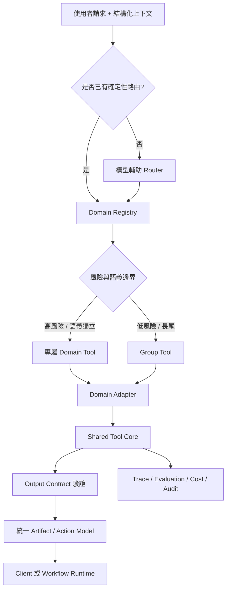

# Tool Schema 與 Registry-driven Routing

[English](./README.md) | [繁體中文](./README-zh-TW.md)

用來設計模型可見的 Tool Contract、在大量相似能力之間進行路由，並治理生產環境中的 Tool Calling 行為。

> 所有範例均為合成資料。這個 `模式` 不依賴特定通訊產品、交易平台或模型供應商。

## 問題本質

Tool Schema 會同時影響函數 JSON 參數與下列行為：

- 模型是否選中正確能力
- 模型是否以正確語義與格式抽取參數
- 相似 Domain 是否互相污染
- Runtime 是否能驗證、授權、觀測與回滾 Tool Call
- 最終 Artifact 或 Action 是否安全可靠

傳統 DRY 原則仍然重要，但不能套錯層。單一泛化 Tool 可能減少代碼重複，卻同時增加模型歧義與生產風險。

## 參考架構



## 核心原則

1. **語義分域、內核共享。** 模型可見邊界保持明確，內部復用驗證、埋點、Fallback 與渲染能力。
2. **結構化事實優先於推斷。** 已由可信 Metadata 宣告的 Domain，不應再要求模型猜測。
3. **Router 分類，Domain Tool 執行。** Router 不應演化成第二套業務服務層。
4. **Router Contract 穩定，Registry 動態擴展。** 新增低風險 Domain 不應頻繁改 Router Schema。
5. **高風險專屬、低風險收斂。** 涉及資金、身份、資格、寫入或不可逆操作的能力應拆分。
6. **輸入與輸出都是契約。** JSON Schema 約束參數，Runtime Output Validation 約束操作事實。
7. **評測屬於設計的一部分。** Tool 選擇、參數、跨域誤調、Fallback、安全、延遲與成本都必須可量測。

## 合成參考 Domain

| Domain | 核心語義 | 典型風險 |
|---|---|---|
| Claimable Grant | 領取已配置或分配的資產 | 寫入、庫存、詐欺 |
| Redeemable Voucher | 在條件成立時核銷價值 | 金額、資格、交易狀態 |
| Membership Entitlement | 依身份或等級使用權益 | 身份、存取控制 |
| Policy-based Subsidy | 依政策、地區、品類判斷資格 | 政策、合規、金額 |

這四類範例保留了語義隔離問題，但不依賴任何特定產品。

## 文件地圖

1. [Tool Schema 設計](./docs/01-tool-schema-design-zh-TW.md)  
   模型可見契約、命名、description、參數、Output Contract、語義邊界與 Token 取捨。
2. [Registry-driven Tool Routing](./docs/02-registry-driven-tool-routing-zh-TW.md)  
   路由瀑布、動態 Registry、候選 Tool 縮小、風險分組與擴展策略。
3. [Tool 治理、評測與可觀測性](./docs/03-tool-governance-and-evaluation-zh-TW.md)  
   生命週期、Owner、版本、資料集、指標、灰度、回滾、授權與事故處理。

輔助資產：

- [設計模式](./patterns/README-zh-TW.md)
- [模板](./templates/README-zh-TW.md)

## 快速判斷

出現以下任一條件時，優先使用專屬 Tool：

- 操作會修改持久狀態
- 涉及金額、身份、政策或資格
- Status Model 或 Action Vocabulary 有實質差異
- Service Owner、授權或回滾策略不同
- 調錯 Tool 會產生不安全或誤導性的操作

只有在以下條件全部成立時，才適合使用 Group Tool：

- 能力是唯讀或純展示
- 字段語義相同，而非只是在 JSON Shape 上相同
- Output Contract 和 Fallback 策略等價
- 子類型判錯不會造成財務、法務或不可逆影響

## 非目標

這個 `模式` 不是：

- 可直接上線的 Router 實作
- Server-side Authorization 的替代品
- 模型必定正確調用 Tool 的保證
- 把所有內部 API 暴露給模型的理由
- 把頻繁變動的政策規則塞進 description 的做法
- OpenAI、Anthropic、LangChain、LangGraph 或 MCP 的專屬方案

## 建議閱讀順序

```text
README
→ Tool Schema 設計
→ Registry-driven Tool Routing
→ 治理與評測
→ Patterns
→ Templates
```

## 來源說明

Schema 撰寫原則參考
[Tool Schema 設計模式詳解](https://developer.volcengine.com/articles/7622979721047277606)，
並在此基礎上補充 Domain Boundary、Tool Routing、Output Contract、治理與生產評測設計。
