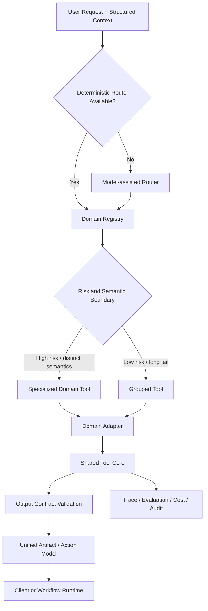

# Tool Schema & Registry-driven Routing

[English](./README.md) | [繁體中文](./README-zh-TW.md)

It is used to design model-visible Tool Contracts, route between a large number of similar capabilities, and govern Tool Calling behavior in production environments.

> All examples are synthetic. This pattern does not depend on a messaging product,
> a commerce platform, or a specific model provider.

## The Problem

A tool schema shapes more than the JSON arguments for a function:

- whether the model selects the correct capability
- whether arguments are extracted with the correct meaning and format
- whether similar domains contaminate one another
- whether the runtime can validate, authorize, observe, and roll back a call
- whether the final artifact or action is safe to expose

Traditional DRY principles still matter, but they should not be applied at the
wrong layer. A single generic tool may reduce code duplication while increasing
model ambiguity and operational risk.

## Reference Architecture



## Core Principles

1. **Specialized boundaries, shared core.** Keep model-facing semantics explicit;
   reuse validation, telemetry, fallback, and rendering internally.
2. **Structured facts before inference.** Do not ask a model to rediscover a
   domain already declared by trusted metadata.
3. **Routers classify; domain tools execute.** A router should not become a
   second business-service layer.
4. **Stable router contract, dynamic registry.** New low-risk domains should not
   require rewriting the router schema.
5. **High-risk specialized, low-risk grouped.** Separate capabilities that affect
   money, identity, eligibility, mutation, or irreversible actions.
6. **Input and output are both contracts.** JSON Schema constrains arguments;
   runtime output validation constrains operational facts.
7. **Evaluation is part of design.** Selection accuracy, argument accuracy,
   domain mismatch, fallback, safety, latency, and cost must be measurable.

## Synthetic Reference Domains

The examples use four generic domains:

| Domain | Core semantic | Typical risk |
|---|---|---|
| Claimable Grant | claim an allocated benefit | mutation, inventory, fraud |
| Redeemable Voucher | redeem value under conditions | money, eligibility, order state |
| Membership Entitlement | use rights based on identity or level | identity, access control |
| Policy-based Subsidy | qualify under policy, region, and category | policy, compliance, money |

They demonstrate semantic separation without depending on a particular product.

## Documentation Map

1. [Tool Schema Design](./docs/01-tool-schema-design.md)  
   Model-facing contracts, naming, descriptions, parameters, output contracts,
   semantic boundaries, and token trade-offs.
2. [Registry-driven Tool Routing](./docs/02-registry-driven-tool-routing.md)  
   Routing cascade, dynamic registries, candidate shortlists, risk grouping, and
   extension policies.
3. [Tool Governance, Evaluation, and Observability](./docs/03-tool-governance-and-evaluation.md)  
   Lifecycle, ownership, versions, datasets, metrics, rollout, rollback,
   authorization, and incident handling.

Supporting assets:

- [Patterns](./patterns/README.md)
- [Templates](./templates/README.md)

## Quick Decision Guide

Use a specialized tool when one or more are true:

- the operation changes durable state
- the operation affects money, identity, policy, or eligibility
- the status model or action vocabulary differs materially
- the service owner, authorization policy, or rollback policy differs
- using the wrong tool could produce an unsafe or misleading action

Use a grouped tool when all are true:

- the capability is read-only or display-only
- fields share the same meaning, not only the same shape
- the output contract and fallback policy are equivalent
- a wrong subtype does not create financial, legal, or irreversible impact

## Non-goals

This pattern is not:

- a production-ready router implementation
- a replacement for server-side authorization
- a guarantee that a model will call tools correctly
- an argument for exposing every internal API to a model
- a reason to encode volatile policy rules in descriptions
- tied to OpenAI, Anthropic, LangChain, LangGraph, MCP, or any one framework

## Reading Path

```text
README
→ Tool Schema Design
→ Registry-driven Tool Routing
→ Governance and Evaluation
→ Patterns
→ Templates
```

## Source Note

The schema-writing rules are informed by the general guidance in
[Tool Schema 設計模式詳解](https://developer.volcengine.com/articles/7622979721047277606),
then extended here with domain boundaries, routing, output contracts, governance,
and production evaluation practices.
