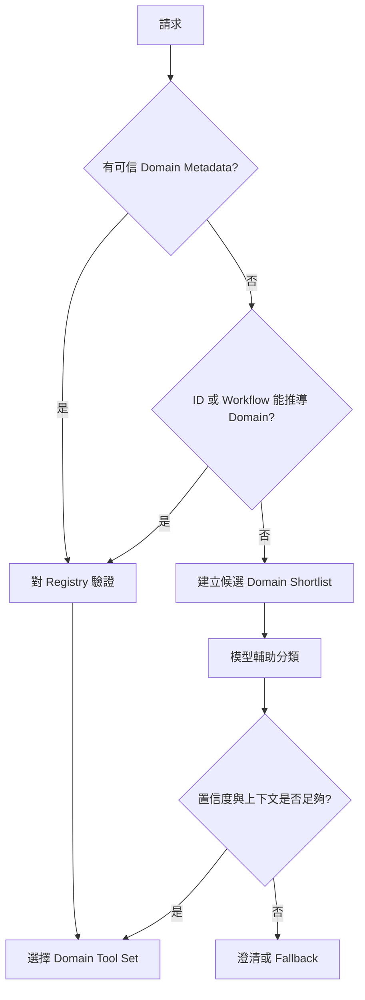

# Registry-driven Tool Routing

[English](./02-registry-driven-tool-routing.md) | [繁體中文](./02-registry-driven-tool-routing-zh-TW.md)

## 1. Routing 是 Runtime Concern

Router 的目的，是在執行前縮小 Tool 搜尋空間。它可以實作為：

- 確定性應用代碼
- Policy／Rules Engine
- 輕量分類器
- 模型輔助分類步驟
- 模型可見的唯讀 Router Tool

不要因為有 Router 概念，就固定增加一次模型調用。可信結構化 Metadata 已能辨識 Domain 時，應直接確定性路由。

## 2. Routing Cascade

按訊號可信度由高到低處理：

```text
1. 明確且可信的 Domain Metadata
2. Resource Type 與 ID Namespace
3. 當前 Interaction Surface 與 Workflow State
4. Registry Alias 與確定性規則
5. 模型輔助分類
6. 澄清或安全 Fallback
```



模型不應重新推斷 Runtime 已知的事實。

## 3. 為什麼硬編碼 Router Enum 無法長期擴展

初期把全部 Domain 寫成 Enum 很安全：

```ts
domain: {
  type: "string",
  enum: [
    "claimable_grant",
    "redeemable_voucher",
    "membership_entitlement",
    "policy_subsidy"
  ]
}
```

但每新增一個 Domain，可能都要修改：

- Router Input Schema
- Router Output Type
- description 與 examples
- Tool Mapping
- 評測資料集
- Prompt Version 與發布審批

Router 會變成中央變更瓶頸。

更合理的拆分：

- **Stable Router Contract**：接收通用 Routing Evidence
- **Dynamic Domain Registry**：儲存 Domain 與 Tool Mapping
- **Specialized or Grouped Tools**：保留執行邊界

## 4. Router Contract

Router 應接收證據，不應接收所有 Domain 的完整業務字段。

```ts
type ToolRouteRequest = {
  userText: string;
  surface: string;
  structuredContext?: {
    declaredDomain?: string;
    resourceType?: string;
    resourceId?: string;
    source?: string;
    categoryCode?: string;
  };
  workflowState?: string;
  locale?: string;
};

type ToolRouteDecision = {
  domain: string | "unknown";
  confidence: number;
  candidateToolNames: string[];
  routeSource:
    | "trusted_metadata"
    | "deterministic_rule"
    | "model_classifier"
    | "fallback";
  missingContext: string[];
  reasonCode: string;
  registryVersion: string;
};
```

Audit-critical 字段不要依賴自由文本 Chain of Thought，應使用穩定 Reason Code。

若 Router 以模型可見 Tool 形式存在，description 必須明確：它只分類，不查即時狀態、不計算價值、不執行 Action。

## 5. Domain Registry

```ts
type RiskLevel = "low" | "medium" | "high";

type ToolDomainRegistration = {
  domain: string;
  displayName: string;
  aliases: string[];
  identifierPatterns: string[];
  supportedSurfaces: string[];
  identifyingFields: string[];
  targetTools: string[];
  groupedTool?: string;
  riskLevel: RiskLevel;
  mutation: boolean;
  enabled: boolean;
  schemaVersion: string;
  owner: string;
};
```

範例：

```ts
export const toolDomainRegistry: ToolDomainRegistration[] = [
  {
    domain: "claimable_grant",
    displayName: "Claimable Grant",
    aliases: ["grant", "claim", "allocation"],
    identifierPatterns: ["^grant_"],
    supportedSurfaces: ["assistant", "account_portal", "support"],
    identifyingFields: ["grantId"],
    targetTools: ["get_claimable_grant_state", "claim_grant"],
    riskLevel: "high",
    mutation: true,
    enabled: true,
    schemaVersion: "1.0.0",
    owner: "benefit-platform"
  },
  {
    domain: "campaign_display",
    displayName: "Campaign Display",
    aliases: ["promotion", "banner", "campaign"],
    identifierPatterns: ["^campaign_"],
    supportedSurfaces: ["assistant", "portal"],
    identifyingFields: ["campaignId"],
    targetTools: [],
    groupedTool: "get_marketing_display_state",
    riskLevel: "low",
    mutation: false,
    enabled: true,
    schemaVersion: "1.0.0",
    owner: "growth-platform"
  }
];
```

## 6. Candidate Shortlisting

只有少量 Tool 相關時，不要把整個 Catalog 暴露給模型。

```ts
function shortlistTools(
  request: ToolRouteRequest,
  registry: ToolDomainRegistration[]
): ToolDomainRegistration[] {
  return registry
    .filter((entry) => entry.enabled)
    .filter((entry) =>
      entry.supportedSurfaces.includes(request.surface)
    )
    .filter((entry) => {
      const declared = request.structuredContext?.declaredDomain;
      if (declared) return entry.domain === declared;

      const id = request.structuredContext?.resourceId;
      if (!id) return true;

      return entry.identifierPatterns.some((pattern) =>
        new RegExp(pattern).test(id)
      );
    });
}
```

只把 Shortlist 的 Domain 定義或 Tool 傳給模型分類器，可降低 Token 與跨域干擾。

## 7. 依風險決定 Tool 粒度

### 專屬 Tool

出現以下特徵時應使用專屬 Tool：

- 修改狀態
- 涉及金額、身份、政策、存取或資格
- 有獨立 Status／Error Model
- Owner 或 Authorization 不同
- 需要專屬 Audit、Rate Limit 或 Rollback

### Group Tool

只有以下情況適合收斂：

- 唯讀或純展示
- 不同子類型在語義上等價
- 使用同一 Output Contract 與 Fallback Policy
- 子類型判斷不完美也不會造成安全事故

```text
高風險 Domain → 專屬 Tool
低風險長尾 Domain → Group Tool
```

不能因為最終使用同一個 UI Component，就認定業務 Tool 可以合併。

## 8. 新增 Domain 的流程

### 低風險 Domain

1. 新增 Registry Entry。
2. 映射至既有 Group Tool。
3. 補正向、負向與模糊 Routing Case。
4. 發布新的 Registry Version。
5. 監控 Mismatch 與 Fallback。

Router Schema 不需要改。

### 高風險 Domain

1. 定義 Domain Boundary 與 Owner。
2. 新增專屬 Input／Output Contract。
3. 定義 Authorization、Idempotency 與 Audit。
4. 新增 Registry Entry 與 Route Rule。
5. 完成離線評測與 Shadow Traffic。
6. 先啟用唯讀行為，再開寫操作。
7. 使用 Domain-level Kill Switch 灰度上線。

## 9. Confidence 與 Clarification

Confidence Threshold 是產品策略，不是固定常數。參考做法：

```text
高置信度 + 完整可信上下文
→ 執行 Read Tool 或繼續 Workflow

中置信度
→ 結合 Registry、Resource Metadata 與 Workflow State

低置信度或可信事實互相衝突
→ 澄清、拒絕猜測或走安全 Fallback
```

模型高置信度不能覆蓋相反的可信 Metadata，也不代表取得授權。

## 10. Router 可觀測字段

```text
route.request_id
route.registry_version
route.declared_domain
route.selected_domain
route.route_source
route.confidence
route.candidate_count
route.selected_tools
route.missing_context
route.reason_code
route.latency_ms
route.token_input
route.token_output
```

這些字段要能和後續 Tool Call、Output Artifact 串成同一條 Trace。

## 11. 常見失敗模式

| 失敗 | 根因 | 控制方式 |
|---|---|---|
| Router 變成業務邏輯層 | 分類與執行混合 | Router Output 保持 Declarative |
| 全部 Domain 寫在 Enum | 中央 Schema 頻繁變更 | Dynamic Registry |
| 整個 Tool Catalog 傳模型 | 沒有 Shortlist | 先按 Metadata 與 Surface 縮小 |
| 歷史上下文壓過當前資源 | Source Authority 不清 | 當前 Structured Context 優先 |
| Group Tool 執行高風險寫入 | 按 UI Shape 合併 | 按語義與風險分域 |
| 新 Alias 靜默改變路由 | Registry 未版本化 | Version、Test、Stage、Rollback |

## 12. Review Checklist

- [ ] 是否真的需要 Router，還是可信 Metadata 已能直接路由？
- [ ] Router 是否只分類，而不執行 Domain Logic？
- [ ] 新增 Domain 時 Router Contract 是否保持穩定？
- [ ] Registry 是否版本化且有 Owner？
- [ ] 是否在模型選擇前縮小 Candidate Tool？
- [ ] 高風險與低風險 Domain 是否採用不同策略？
- [ ] 是否可單獨停用一個 Domain？
- [ ] Unknown、Conflict、Missing Context 是否有明確狀態？
- [ ] Route Decision 是否可追蹤到 Tool Call 與 Artifact？
