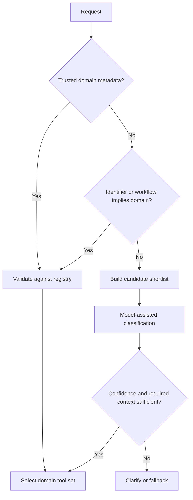

# Registry-driven Tool Routing

[English](./02-registry-driven-tool-routing.md) | [繁體中文](./02-registry-driven-tool-routing-zh-TW.md)

## 1. Routing Is a Runtime Concern

A router reduces the tool search space before execution. It may be implemented as:

- deterministic application code
- a policy or rules engine
- a lightweight classifier
- a model-assisted classification step
- a model-visible read-only tool

Do not automatically add a model call or a router tool. If trusted structured
metadata already identifies the domain, route deterministically.

## 2. Routing Cascade

Use the strongest available signal first:

```text
1. Explicit trusted domain metadata
2. Resource type and identifier namespace
3. Current interaction surface and workflow state
4. Registry aliases and deterministic rules
5. Model-assisted classification
6. Clarification or safe fallback
```



The model should not infer facts the runtime already knows.

## 3. Why a Hard-coded Router Enum Does Not Scale

A router schema that enumerates every domain is initially safe:

```ts
domain: {
  type: "string",
  enum: [
    "claimable_grant",
    "redeemable_voucher",
    "membership_entitlement",
    "policy_subsidy"
  ]
}
```

But every new domain may require changes to:

- router input schema
- router output type
- descriptions and examples
- tool mapping
- evaluation datasets
- prompt versions and release approvals

The router becomes a central change bottleneck.

A better split is:

- **stable router contract:** accepts common routing evidence
- **dynamic domain registry:** stores supported domains and mappings
- **specialized or grouped tools:** preserve execution boundaries

## 4. Router Contract

A router should accept evidence, not every possible business field.

```ts
type ToolRouteRequest = {
  userText: string;
  surface: string;
  structuredContext?: {
    declaredDomain?: string;
    resourceType?: string;
    resourceId?: string;
    source?: string;
    categoryCode?: string;
  };
  workflowState?: string;
  locale?: string;
};

type ToolRouteDecision = {
  domain: string | "unknown";
  confidence: number;
  candidateToolNames: string[];
  routeSource:
    | "trusted_metadata"
    | "deterministic_rule"
    | "model_classifier"
    | "fallback";
  missingContext: string[];
  reasonCode: string;
  registryVersion: string;
};
```

Keep free-form reasoning out of audit-critical fields. Prefer stable reason codes.

If the router is exposed as a model-visible tool, keep it read-only and state in
the description that it only classifies; it does not query live state, calculate
value, or perform actions.

## 5. Domain Registry

```ts
type RiskLevel = "low" | "medium" | "high";

type ToolDomainRegistration = {
  domain: string;
  displayName: string;
  aliases: string[];
  identifierPatterns: string[];
  supportedSurfaces: string[];
  identifyingFields: string[];
  targetTools: string[];
  groupedTool?: string;
  riskLevel: RiskLevel;
  mutation: boolean;
  enabled: boolean;
  schemaVersion: string;
  owner: string;
};
```

Example:

```ts
export const toolDomainRegistry: ToolDomainRegistration[] = [
  {
    domain: "claimable_grant",
    displayName: "Claimable Grant",
    aliases: ["grant", "claim", "allocation"],
    identifierPatterns: ["^grant_"],
    supportedSurfaces: ["assistant", "account_portal", "support"],
    identifyingFields: ["grantId"],
    targetTools: ["get_claimable_grant_state", "claim_grant"],
    riskLevel: "high",
    mutation: true,
    enabled: true,
    schemaVersion: "1.0.0",
    owner: "benefit-platform"
  },
  {
    domain: "campaign_display",
    displayName: "Campaign Display",
    aliases: ["promotion", "banner", "campaign"],
    identifierPatterns: ["^campaign_"],
    supportedSurfaces: ["assistant", "portal"],
    identifyingFields: ["campaignId"],
    targetTools: [],
    groupedTool: "get_marketing_display_state",
    riskLevel: "low",
    mutation: false,
    enabled: true,
    schemaVersion: "1.0.0",
    owner: "growth-platform"
  }
];
```

## 6. Candidate Shortlisting

Do not expose the entire catalog when only a few tools are relevant.

```ts
function shortlistTools(
  request: ToolRouteRequest,
  registry: ToolDomainRegistration[]
): ToolDomainRegistration[] {
  return registry
    .filter((entry) => entry.enabled)
    .filter((entry) =>
      entry.supportedSurfaces.includes(request.surface)
    )
    .filter((entry) => {
      const declared = request.structuredContext?.declaredDomain;
      if (declared) return entry.domain === declared;

      const id = request.structuredContext?.resourceId;
      if (!id) return true;

      return entry.identifierPatterns.some((pattern) =>
        new RegExp(pattern).test(id)
      );
    });
}
```

Then pass only the shortlisted domain definitions or tools to the model-assisted
classifier. This reduces token usage and cross-domain interference.

## 7. Risk-based Tool Grouping

### Dedicated tool

Use a dedicated tool when the capability:

- mutates state
- affects money, identity, policy, access, or eligibility
- has a unique status or error model
- has different authorization or ownership
- requires dedicated audit, rate limiting, or rollback

### Grouped tool

Use a grouped tool when the capability is:

- read-only or display-only
- semantically equivalent across subtypes
- governed by one output contract and fallback policy
- safe even if a subtype is classified imperfectly

```text
High-risk domain → specialized tool
Low-risk long tail → grouped tool
```

Do not group merely because two outputs render with the same component.

## 8. Adding a New Domain

### Low-risk domain

1. Add a registry entry.
2. Map it to an existing grouped tool.
3. Add positive, negative, and ambiguous route cases.
4. Release the registry version.
5. Monitor mismatch and fallback metrics.

The router schema does not need to change.

### High-risk domain

1. Define the domain boundary and owner.
2. Add dedicated input and output contracts.
3. Define authorization, idempotency, and audit policy.
4. Add a registry entry and route rules.
5. Add offline evaluation and shadow traffic.
6. Enable read-only behavior before mutation.
7. Roll out with a domain-level kill switch.

## 9. Confidence and Clarification

Confidence thresholds are policy, not universal constants. A reference policy:

```text
High confidence + complete trusted context
→ execute read tool or continue workflow

Medium confidence
→ combine registry evidence, resource metadata, and workflow state

Low confidence or conflicting trusted facts
→ clarify, abstain, or use a safe fallback
```

Never let model confidence override contradictory trusted metadata. A high model
score is not authorization.

## 10. Router Observability

Record:

```text
route.request_id
route.registry_version
route.declared_domain
route.selected_domain
route.route_source
route.confidence
route.candidate_count
route.selected_tools
route.missing_context
route.reason_code
route.latency_ms
route.token_input
route.token_output
```

Join these fields with the subsequent tool call and final artifact trace.

## 11. Common Failure Modes

| Failure | Cause | Control |
|---|---|---|
| Router becomes business logic | classification and execution mixed | keep router output declarative |
| Every domain is in one enum | central schema churn | dynamic registry |
| Entire catalog sent to model | no shortlist | route by metadata and surface first |
| Wrong history dominates current resource | weak source authority | current structured context wins |
| Group tool handles risky mutation | grouping by UI shape | classify by semantic and risk boundary |
| New alias changes behavior silently | unversioned registry | version, test, stage, and roll back |

## 12. Review Checklist

- [ ] Is a router actually needed, or can trusted metadata route directly?
- [ ] Does the router classify without executing domain logic?
- [ ] Is the router contract stable across domain additions?
- [ ] Is the registry versioned and owned?
- [ ] Are candidate tools narrowed before model selection?
- [ ] Are high-risk and low-risk domains treated differently?
- [ ] Can a single domain be disabled without disabling all tools?
- [ ] Are unknown, conflicting, and missing-context states explicit?
- [ ] Are route decisions traceable to tool calls and artifacts?
