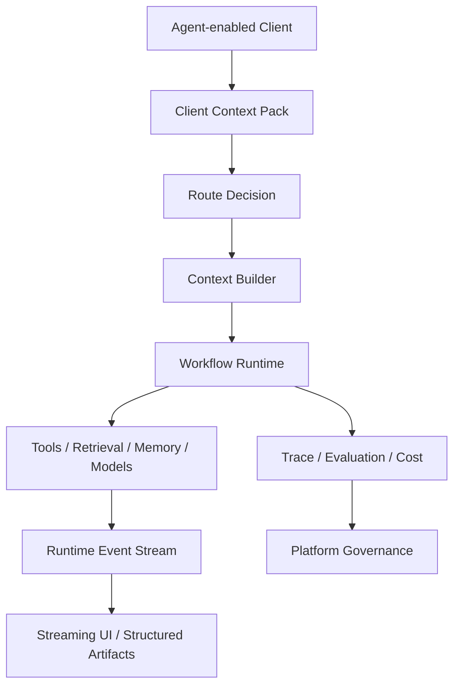

# AI Agent 上下文工程

[English](./README.md) | [繁體中文](./README-zh-TW.md)

一套以 TypeScript 為優先、用於選擇、組裝、傳遞、評估與治理 AI Agent 上下文的參考架構。

本工程把 Context 視為 Runtime 系統，串接 Context Route、漸進式披露、RAG、Memory、Tool、多模態資產、終端事件、工作流執行、可觀測性與平台治理。

> 本倉庫記錄的是參考架構。  
> 所有場景、識別碼、指標與 Payload 均為合成示例。  
> 真正導入生產環境前，仍需完成領域驗證、安全審查、評估與營運控制。

## 本工程涵蓋什麼

整套文件主要回答三個問題：

1. 模型在每一個推理步驟中應該看見什麼？
2. 終端應如何承接、展示、取消、恢復與修復一次 Agent Run？
3. 多個 Agent、Tool、Prompt、Workflow、Memory Policy、Schema 與 Eval 應如何被統一治理？



## 文件導覽

1. [上下文工程核心](./docs/01-context-engineering-core-zh-TW.md)  
   說明 Context 資料源、權威性、Route、漸進式披露、RAG、Memory、Tool Context、多模態、Token 治理與評估。

2. [Agent 終端與工作流 Runtime](./docs/02-agent-client-runtime-zh-TW.md)  
   說明 Client Context Pack、Runtime Event、Streaming State、工作流執行、Tool 生命週期、Structured Artifact、取消、重試、恢復與最小可運行縱向鏈路。

3. [Agent 平台營運與治理](./docs/03-agent-platform-operations-zh-TW.md)  
   說明 ContextOps、Registry、Observability、Eval Dataset、成本控制、權限、發布、回滾與成熟度模型。

輔助區域：

- [Patterns](./patterns/README-zh-TW.md)
- [Templates](./templates/README-zh-TW.md)

## 核心原則

```text
先 Route，再組裝。
先摘要，再展開。
優先使用最小但足夠的 Context。
精確狀態使用結構化資料。
非結構化知識使用 Retrieval。
即時狀態使用 Tool 或 Database。
Memory 應拆成多種 Store，避免收斂成單一 Vector Database。
模型負責理解與解釋，不負責臆造營運事實。
終端應承接 Runtime Event，並將文字 Token 視為其中一種輸出。
所有策略都必須可觀測、可評估、可發布、可回滾。
```

## 參考場景

| 場景 | 用來說明 |
|---|---|
| 知識助手 | Retrieval、Rerank、Evidence、Citation、Faithfulness |
| 即時狀態助手 | Read-only Tool、來源權威性、結構化狀態 Artifact |
| 支援工作流 | 多輪狀態、Memory、資格檢查、審批、Fallback |
| 多模態助手 | Asset Context、OCR / ASR / Vision、信心分數、澄清 |
| 開發者助手 | Repository Context、Tool 選擇、Patch Artifact、驗證 |

## 範圍

- Context 資料源選擇與組裝
- Route Policy 與漸進式披露
- Retrieval 與 Hybrid Memory
- Tool Context 與輸出裁剪
- 多模態 Asset Context
- 終端 Context 採集
- Runtime Event Protocol
- Workflow State 與恢復
- Structured Artifact Rendering
- Trace、Eval、成本、發布與治理

## 非目標

本工程不是：

- 可直接上線的託管平台
- 領域權限系統的替代品
- 模型輸出正確性的保證
- 所有 Runtime 與 Registry 的完整實作
- 未經審查就把私有資料送入模型的理由
- 安全、隱私、法務與可靠性控制的替代品

## 建議模組結構

```text
context-engineering/
├─ README.md
├─ README-zh-TW.md
├─ docs/
│  ├─ 01-context-engineering-core.md
│  ├─ 01-context-engineering-core-zh-TW.md
│  ├─ 02-agent-client-runtime.md
│  ├─ 02-agent-client-runtime-zh-TW.md
│  ├─ 03-agent-platform-operations.md
│  └─ 03-agent-platform-operations-zh-TW.md
├─ patterns/
│  ├─ README.md
│  └─ README-zh-TW.md
└─ templates/
   ├─ README.md
   └─ README-zh-TW.md
```

## 閱讀路徑

```text
README
→ Context Routing
→ Progressive Disclosure
→ Client Context Pack
→ Runtime Event Protocol
→ Observability
```

文件使用 TypeScript Contract 與 Mermaid 表達架構與邊界。實際使用時，應依模型供應商、工作流引擎、終端框架、儲存層與安全模型調整。
