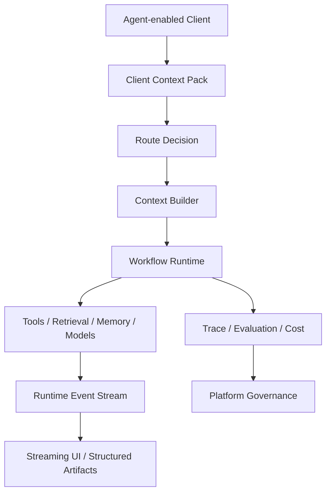

# Context Engineering for AI Agents

[English](./README.md) | [繁體中文](./README-zh-TW.md)

A TypeScript-first reference architecture for selecting, assembling, delivering, evaluating, and governing context for AI agents and agent-enabled clients.

This Engineering treats context as a runtime system rather than a long prompt. It connects routing, progressive disclosure, retrieval, memory, tools, multimodal assets, client runtime events, workflow execution, observability, and platform governance.

> This repository documents a reference architecture.  
> All scenarios, identifiers, metrics, and payloads are synthetic.  
> Production adoption requires domain-specific validation, security review, evaluation, and operational controls.

## What This Module Covers

The documentation answers three questions:

1. What should the model see at each reasoning step?
2. How should a client receive, display, cancel, resume, and recover an agent run?
3. How should multiple agents, tools, prompts, workflows, memory policies, schemas, and evaluations be governed?



## Documentation Map

1. [Context Engineering Core](./docs/01-context-engineering-core.md)  
   Context sources, authority, routing, progressive disclosure, retrieval, memory, tool context, multimodal context, token control, and evaluation.

2. [Agent Client & Workflow Runtime](./docs/02-agent-client-runtime.md)  
   Client Context Pack, runtime events, streaming state, workflow execution, tool lifecycle, structured artifacts, cancellation, retry, resume, and a runnable vertical slice.

3. [Agent Platform Operations & Governance](./docs/03-agent-platform-operations.md)  
   ContextOps, registries, observability, evaluation datasets, cost controls, permissions, release, rollback, and maturity levels.

Supporting areas:

- [Patterns](./patterns/README.md)
- [Templates](./templates/README.md)

## Core Principles

```text
Route before assembly.
Summarize before expansion.
Prefer the smallest sufficient context.
Use structured facts for exact state.
Use retrieval for unstructured knowledge.
Use tools or databases for live state.
Treat memory as multiple stores; keep vector memory as one store among others.
Let models interpret and explain; do not let them invent operational facts.
Expose runtime events to clients instead of streaming text alone.
Make every policy observable, evaluable, releasable, and reversible.
```

## Reference Scenarios

| Scenario | What It Demonstrates |
|---|---|
| Knowledge assistant | Retrieval, reranking, evidence, citations, faithfulness |
| Live status assistant | Read-only tools, source authority, structured status artifacts |
| Support workflow | Multi-turn state, memory, eligibility checks, approval, fallback |
| Multimodal assistant | Asset context, OCR / ASR / vision, confidence, clarification |
| Developer assistant | Repository context, tool selection, patch artifacts, validation |

## Scope

- context source selection and assembly
- route policies and progressive disclosure
- retrieval and hybrid memory
- tool context and output pruning
- multimodal asset context
- client context collection
- runtime event protocols
- workflow state and recovery
- structured artifact rendering
- traces, evaluation, cost, release, and governance

## Non-goals

This Engineering is not:

- a production-ready hosted platform
- a replacement for domain-specific authorization
- a guarantee that a model output is correct
- a complete implementation of every runtime and registry
- a reason to send private data to a model without review
- a substitute for security, privacy, legal, and reliability controls

## Suggested Module Structure

```text
context-engineering/
├─ README.md
├─ README-zh-TW.md
├─ docs/
│  ├─ 01-context-engineering-core.md
│  ├─ 01-context-engineering-core-zh-TW.md
│  ├─ 02-agent-client-runtime.md
│  ├─ 02-agent-client-runtime-zh-TW.md
│  ├─ 03-agent-platform-operations.md
│  └─ 03-agent-platform-operations-zh-TW.md
├─ patterns/
│  ├─ README.md
│  └─ README-zh-TW.md
└─ templates/
   ├─ README.md
   └─ README-zh-TW.md
```

## Reading Path

```text
README
→ Context Routing
→ Progressive Disclosure
→ Client Context Pack
→ Runtime Event Protocol
→ Observability
```

The TypeScript contracts and Mermaid diagrams express architecture and boundaries. Adapt them to the selected model provider, workflow engine, client framework, storage layer, and security model.
