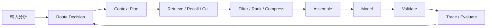
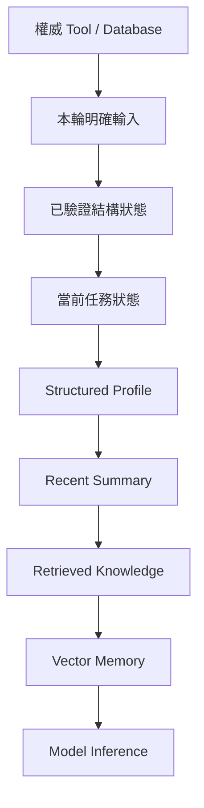
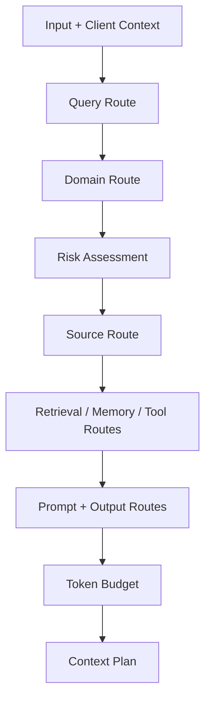
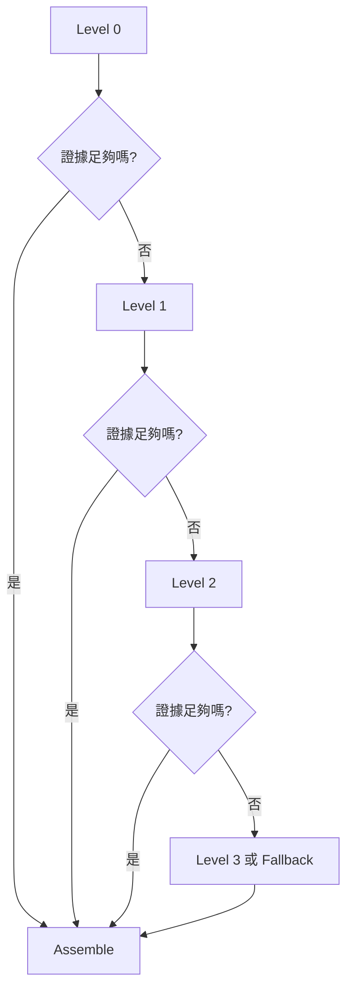
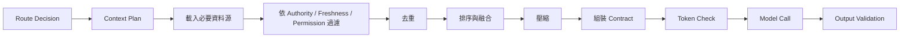
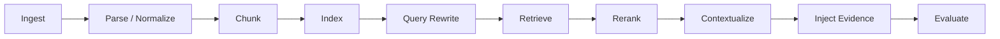
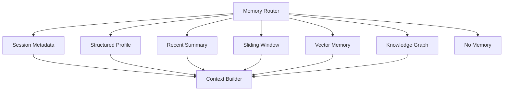

# 上下文工程核心

[English](./01-context-engineering-core.md) | [繁體中文](./01-context-engineering-core-zh-TW.md)

本文件定義此模組使用的上下文工程標準模型。

[返回模組首頁](../README-zh-TW.md)

## 1. 基礎概念

上下文工程是針對單次執行步驟，選擇、轉換、排序、分配預算並驗證模型可見資訊的工程過程。

| Prompt Engineering | Context Engineering |
|---|---|
| 優化指令與示例 | 管理完整資訊環境 |
| 常聚焦單次請求 | 跨 Run、Tool、Memory 與 Workflow 運作 |
| 主要處理文字 | 包含結構狀態、Asset、Tool Output 與 History |
| 通常較靜態 | 由 Route 與 Runtime 動態決定 |
| 關注答案品質 | 同時量測來源品質、延遲與 Token 效率 |

Context 應保持**最小但足夠**，並依 Route 證據逐步展開。



## 2. 資料源與權威性

典型資料源：

1. System Instructions
2. 當前輸入
3. 最近互動狀態
4. Retrieved Knowledge
5. Memory
6. Tool Definitions 與 Outputs
7. Structured Application Data
8. 多模態 Asset Metadata 與抽取結果

建議權威順序：



較低層來源不能靜默覆蓋較高層來源。

```ts
interface ContextSourceRef {
  sourceId: string;
  sourceType:
    | 'system'
    | 'input'
    | 'interaction'
    | 'retrieval'
    | 'memory'
    | 'tool'
    | 'structured'
    | 'asset';
  authority: 'authoritative' | 'verified' | 'advisory' | 'inferred';
  observedAt?: number;
  expiresAt?: number;
  version?: string;
  traceId?: string;
}
```

## 3. Context Routing

Route 在開啟昂貴資料源前，先決定本次要執行哪一條 Context Pipeline。

| Route | 決策問題 |
|---|---|
| Query Route | 這是什麼類型的任務？ |
| Domain Route | 由哪個 Bound Capability 負責？ |
| Source Route | 哪些資料源必要？ |
| Retrieval Route | Sparse、Dense、Hybrid、Graph 或不檢索？ |
| Memory Route | 哪一層 Memory 有關？ |
| Tool Route | 應暴露哪一組 Tool？ |
| Prompt Route | 需要哪一個 Instruction Module？ |
| Multimodal Route | 需要哪一條 Asset Processing Path？ |
| Output Route | 應使用哪一種 Response / Artifact Contract？ |
| Fallback Route | 何時停止擴張？ |



```ts
interface RouteDecision {
  queryRoute: string;
  domainRoute?: string;
  sourceRoutes: string[];
  retrievalRoute?: string;
  memoryRoutes?: string[];
  toolRoute?: string;
  promptRoute: string;
  outputRoute: string;
  fallbackRoute: string;
  riskLevel: 'low' | 'medium' | 'high';
  confidence: number;
  reasons: string[];
}
```

低信心 Route 應優先澄清、選安全通用 Route、使用 Read-only Tool 或 Fallback，不應把所有資料源全開。

## 4. 漸進式披露

漸進式披露會延後高成本或高噪音 Context，直到證據不足時才展開。

| 資料源 | Level 0 | Level 1 | Level 2 | Level 3 |
|---|---|---|---|---|
| Retrieval | Metadata / 摘要 | Top Passages | 完整 Section | Source Document |
| Tool Output | State / Reason Code | 必要字段 | 診斷字段 | Raw Trace |
| Interaction History | Task State | Summary | Recent Turns | Archived Transcript |
| Memory | Route Decision | Profile / Summary | Vector Snippets | 原始記錄 |
| Multimodal | Asset Metadata | 抽取結果 | Region / Timestamp | Source Media |
| Prompt | 基礎約束 | Domain Rules | Task Examples | Diagnostics |
| Output | Minimal Schema | Domain Schema | Debug Schema | Raw Output |



展開必須受 Token、Latency、Cost、Retrieval Depth、Tool Call、Retry 與 Risk Budget 限制。

## 5. 組裝流水線

```ts
interface ContextPlan {
  route: RouteDecision;
  requiredSources: string[];
  optionalSources: string[];
  excludedSources: Array<{ source: string; reason: string }>;
  tokenBudget: {
    system: number;
    task: number;
    interaction: number;
    retrieval: number;
    memory: number;
    tools: number;
    structured: number;
    reservedOutput: number;
  };
  disclosureLevel: Record<string, number>;
}
```



```ts
interface FinalContext {
  system: string;
  route: RouteDecision;
  task: { objective: string; constraints: string[] };
  structuredState?: Record<string, unknown>;
  interactionState?: Record<string, unknown>;
  retrievedKnowledge?: Array<{ content: string; source: ContextSourceRef }>;
  memory?: Record<string, unknown>;
  toolResults?: Array<{
    toolName: string;
    result: Record<string, unknown>;
    source: ContextSourceRef;
  }>;
  assets?: Array<Record<string, unknown>>;
  currentInput: string;
}
```

Context Builder 還應輸出 Trace，說明加入與排除哪些資料源。

## 6. Retrieval-Augmented Context

Retrieval 適合非結構化、體積大、相對穩定且可作為 Evidence 的知識，不適合作為高變動營運狀態的事實源。



| Route | 使用情境 |
|---|---|
| sparse | ID、精確術語、名稱 |
| dense | 語意型與口語型 Query |
| hybrid | 精確詞與語意意圖並存 |
| graph | 多實體或多跳關係 |
| no-retrieval | 即時狀態已可由 Tool 取得 |
| policy | Procedure、Specification、Standard |

Chunk 應保留 Heading、List Boundary、Table Context、Source Version、Access Policy、Validity Period 與 Entity Identifier。

追蹤 Context Precision、Recall、Freshness、Duplicate Rate、Unsupported-answer Rate、Citation Correctness、Latency 與 Tokens per Source。

## 7. Hybrid Memory

Memory 應拆成多種 Store。



| 層級 | 生命週期 | 儲存 | 用途 |
|---|---|---|---|
| Session Metadata | Request / Session | Request State | Client Capability、Locale、Timezone |
| Structured Profile | 長期 | Profile Store / Database | 穩定事實與偏好 |
| Recent Summary | Session / 中期 | Session Store | 未完成任務與已確認事實 |
| Sliding Window | 最近互動 | Runtime Buffer | 即時指代與局部一致性 |
| Vector Memory | 長期 | Vector Index | 相似歷史案例 |
| Knowledge Graph | 長期 | Graph / Relational Store | 精確實體與關係 |

```ts
interface MemoryWrite {
  field?: string;
  value: unknown;
  source: 'user_confirmed' | 'tool_verified' | 'system_derived';
  confidence: number;
  observedAt: number;
  expiresAt?: number;
  overwritePolicy: 'replace' | 'merge' | 'append' | 'reject';
  sensitivity?: 'public' | 'internal' | 'sensitive';
}
```

不要寫入未驗證猜測、暫時即時狀態、不必要私有資料或可由權威來源取得的資料。

衝突順序：

```text
權威即時來源
> 本輪明確輸入
> 已驗證結構狀態
> Structured Profile
> Recent Summary
> Sliding Window 舊內容
> Vector Memory
> Model Inference
```

## 8. Tool Context

Tool Context 有兩個問題：

1. 模型為了選擇與呼叫 Tool，需要看到什麼？
2. 模型為了使用 Tool Result，需要看到什麼？

只暴露相關 Tool Set。可以先載入精簡 Descriptor，再為已選 Tool 載入完整 Schema。

```ts
interface ToolDescriptor {
  name: string;
  domain: string;
  summary: string;
  riskLevel: 'low' | 'medium' | 'high';
  sideEffect: 'none' | 'read' | 'write';
}
```

保留 Status、Reason、解釋與 Artifact 必要字段、Confidence、Provenance 與 Trace；移除 Internal Log、無關 Nested Object、重複資料、Secret 與不必要 Raw Payload。

模型可以解釋權威輸出，但不能用 Memory、Retrieval 或推測覆蓋它。

## 9. 多模態 Context

```ts
interface AssetContext {
  assetId: string;
  type: 'image' | 'audio' | 'video' | 'document';
  status: 'uploaded' | 'processing' | 'ready' | 'failed';
  metadata: Record<string, unknown>;
  extracted?: {
    text?: string;
    labels?: string[];
    regions?: unknown[];
    confidence?: number;
  };
}
```

披露順序：

```text
Asset ID 與 Metadata
→ Extracted Text / Labels
→ Regions / Timestamps
→ Source-media Reference
```

低信心抽取結果應觸發澄清或替代 Route。

## 10. Token 預算、壓縮與快取

| 任務形態 | Retrieval | Memory | Tools | Structured State |
|---|---:|---:|---:|---:|
| 知識回答 | 高 | 低 | 低 | 低 |
| 即時狀態 | 低 | 低 | 高 | 高 |
| 支援工作流 | 中 | 中 | 高 | 高 |
| 多模態探索 | 中 | 低 | 高 | 高 |
| 開發者任務 | 中 | 中 | 高 | 高 |

壓縮方式：

- 規則與 Specification 使用 Extractive Summary
- 長互動歷史使用 Abstractive Summary
- Tool Result 使用字段裁剪
- Retrieval 使用去重
- 大型 Evidence Set 使用 Query-aware Compression

必須保留否定、數量、日期、條件、識別碼、來源與 Confidence。

適合快取穩定 Instruction、精簡 Tool Descriptor、Example、Static Schema 與 Versioned Reference。不要全域快取用戶專屬或即時狀態。

## 11. 評估

品質：Context Relevance、Precision、Recall、Freshness、Provenance Coverage、Faithfulness、Correctness、Unsupported Claim Rate。

效率：Input Tokens by Route、Compression Ratio、Context-build Latency、TTFT、Total Latency、Cache Hit Rate、Cost per Run、Progressive Expansion Rate。

Route：Route Accuracy、Domain Mismatch、Source Overuse、Tool Misselection、Fallback Rate。

至少比較：

```text
Full-context Baseline
vs
Route + Progressive Disclosure
```

## 12. 常見失敗模式

| 失敗 | 常見原因 | 修復 |
|---|---|---|
| 檢索錯誤知識 | Chunk 不佳、Index 過期、Route 錯 | 增加 Metadata、Rerank、重建 Eval |
| 用 Memory 回答即時狀態 | 未落實 Authority | 強制 Tool / Database Route |
| 前一任務污染目前任務 | 缺少 Entity / Task Boundary | Reset、綁定 Entity、摘要舊任務 |
| Tool Output 佔滿 Context | 注入 Raw Payload | 字段裁剪與漸進式披露 |
| Memory 與新事實衝突 | Append-only Memory | 結構化覆蓋與 Timestamp |
| Token 增加但品質沒提升 | 所有資料源全開 | 先 Route 並設 Budget |
| 多模態抽取錯誤 | 忽略低信心 | 澄清、重試或 Fallback |
| Router 不確定 | 弱 Keyword Shortcut | 使用明確信號、Confidence、安全 Fallback |

## 13. 參考場景

```text
知識助手：
問題 → Hybrid Retrieval → Rerank → Evidence Pack → Grounded Answer

即時狀態助手：
狀態問題 → Read-only Tool → Pruned Result → Status Artifact

支援工作流：
問題 → Recent Summary → Policy Retrieval → Eligibility Tool → Approval/Fallback

多模態助手：
Asset → Quality Route → Extraction → Confidence Check → Search/Clarification

開發者助手：
任務 → Repository Context Plan → Scoped Retrieval → Validation → Patch Artifact
```
