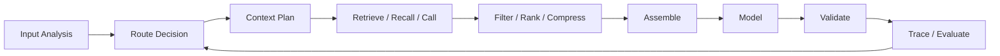
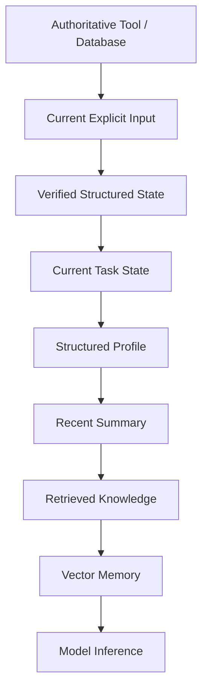
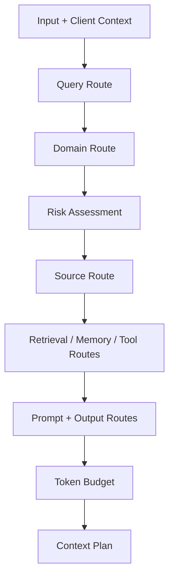
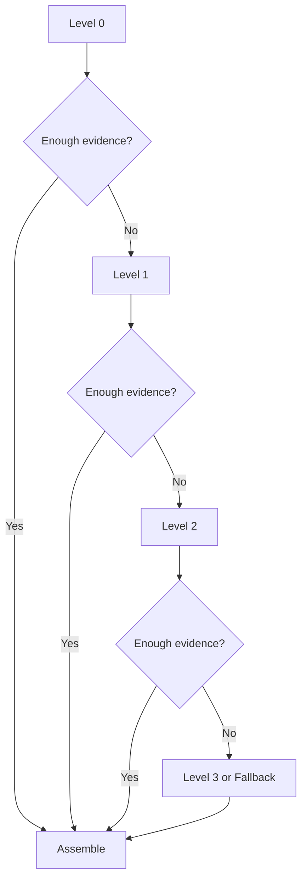
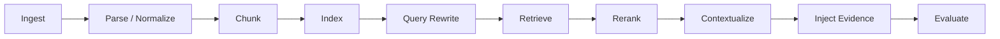
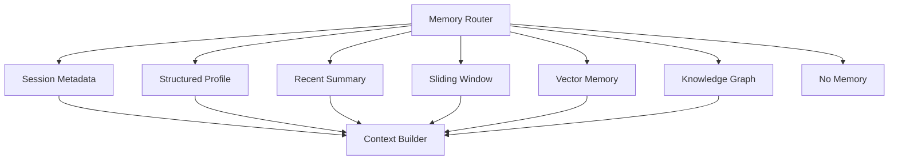

# Context Engineering Core

[English](./01-context-engineering-core.md) | [繁體中文](./01-context-engineering-core-zh-TW.md)

This document defines the canonical context-engineering model used by this module.

[Back to module overview](../README.md)

## 1. Fundamentals

Context engineering selects, transforms, orders, budgets, and validates the information available to a model for one execution step.

| Prompt Engineering | Context Engineering |
|---|---|
| Optimizes instructions and examples | Manages the complete information environment |
| Often focuses on one request | Operates across runs, tools, memory, and workflows |
| Mostly textual | Includes structured state, assets, tool output, and history |
| Usually static | Route-driven and runtime-dependent |
| Measures answer quality | Also measures source quality, latency, and token efficiency |

Keep context **smallest sufficient** and expand it only when route evidence requires it.



## 2. Sources and Authority

Typical sources:

1. system instructions
2. current input
3. recent interaction state
4. retrieved knowledge
5. memory
6. tool definitions and outputs
7. structured application data
8. multimodal asset metadata and extraction results

Suggested authority order:



A lower source must not silently override a higher source.

```ts
interface ContextSourceRef {
  sourceId: string;
  sourceType:
    | 'system'
    | 'input'
    | 'interaction'
    | 'retrieval'
    | 'memory'
    | 'tool'
    | 'structured'
    | 'asset';
  authority: 'authoritative' | 'verified' | 'advisory' | 'inferred';
  observedAt?: number;
  expiresAt?: number;
  version?: string;
  traceId?: string;
}
```

## 3. Context Routing

Routing decides which context pipeline should run before an expensive source is opened.

| Route | Decision |
|---|---|
| Query Route | What kind of task is this? |
| Domain Route | Which bounded capability owns it? |
| Source Route | Which sources are necessary? |
| Retrieval Route | Sparse, dense, hybrid, graph, or none? |
| Memory Route | Which memory layer is relevant? |
| Tool Route | Which tool set should be exposed? |
| Prompt Route | Which instruction module is needed? |
| Multimodal Route | Which asset-processing path is required? |
| Output Route | Which response or artifact contract applies? |
| Fallback Route | When should expansion stop? |



```ts
interface RouteDecision {
  queryRoute: string;
  domainRoute?: string;
  sourceRoutes: string[];
  retrievalRoute?: string;
  memoryRoutes?: string[];
  toolRoute?: string;
  promptRoute: string;
  outputRoute: string;
  fallbackRoute: string;
  riskLevel: 'low' | 'medium' | 'high';
  confidence: number;
  reasons: string[];
}
```

Low-confidence routing should prefer clarification, a safe general route, read-only tools, or fallback. It should not activate every source.

## 4. Progressive Disclosure

Progressive disclosure delays expensive or noisy context until evidence is insufficient.

| Source | Level 0 | Level 1 | Level 2 | Level 3 |
|---|---|---|---|---|
| Retrieval | metadata / summary | top passages | full section | source document |
| Tool output | state / reason code | required fields | diagnostic fields | raw trace |
| Interaction history | task state | summary | recent turns | archived transcript |
| Memory | route decision | profile / summary | vector snippets | original records |
| Multimodal | asset metadata | extraction result | regions / timestamps | source media |
| Prompt | base constraints | domain rules | task examples | diagnostics |
| Output | minimal schema | domain schema | debug schema | raw output |



Expansion must be bounded by token, latency, cost, retrieval depth, tool-call, retry, and risk budgets.

## 5. Assembly Pipeline

```ts
interface ContextPlan {
  route: RouteDecision;
  requiredSources: string[];
  optionalSources: string[];
  excludedSources: Array<{ source: string; reason: string }>;
  tokenBudget: {
    system: number;
    task: number;
    interaction: number;
    retrieval: number;
    memory: number;
    tools: number;
    structured: number;
    reservedOutput: number;
  };
  disclosureLevel: Record<string, number>;
}
```


```ts
interface FinalContext {
  system: string;
  route: RouteDecision;
  task: { objective: string; constraints: string[] };
  structuredState?: Record<string, unknown>;
  interactionState?: Record<string, unknown>;
  retrievedKnowledge?: Array<{ content: string; source: ContextSourceRef }>;
  memory?: Record<string, unknown>;
  toolResults?: Array<{
    toolName: string;
    result: Record<string, unknown>;
    source: ContextSourceRef;
  }>;
  assets?: Array<Record<string, unknown>>;
  currentInput: string;
}
```

The builder should emit a trace describing included and excluded sources.

## 6. Retrieval-Augmented Context

Use retrieval for knowledge that is unstructured, large, relatively stable, and useful as evidence. Do not use it as the source of truth for volatile operational state.



| Route | Use |
|---|---|
| sparse | identifiers, exact terms, names |
| dense | semantic and conversational queries |
| hybrid | exact terms plus semantic intent |
| graph | multi-entity or multi-hop relationships |
| no-retrieval | live state available from a tool |
| policy | procedures, specifications, standards |

Chunking should preserve headings, list boundaries, table context, source version, access policy, validity period, and entity identifiers.

Track context precision, context recall, evidence freshness, duplicate rate, unsupported-answer rate, citation correctness, latency, and tokens per source.

## 7. Hybrid Memory

Treat memory as multiple stores.



| Layer | Lifetime | Storage | Purpose |
|---|---|---|---|
| Session Metadata | request / session | request state | client capability, locale, timezone |
| Structured Profile | long-term | profile store / database | stable facts and preferences |
| Recent Summary | session / medium-term | session store | unfinished tasks and confirmed facts |
| Sliding Window | recent turns | runtime buffer | immediate references and local coherence |
| Vector Memory | long-term | vector index | similar historical cases |
| Knowledge Graph | long-term | graph / relational store | exact entities and relationships |

```ts
interface MemoryWrite {
  field?: string;
  value: unknown;
  source: 'user_confirmed' | 'tool_verified' | 'system_derived';
  confidence: number;
  observedAt: number;
  expiresAt?: number;
  overwritePolicy: 'replace' | 'merge' | 'append' | 'reject';
  sensitivity?: 'public' | 'internal' | 'sensitive';
}
```

Do not write unverified guesses, temporary live state, unnecessary private data, or data that can be fetched authoritatively.

Conflict order:

```text
authoritative live source
> current explicit input
> verified structured state
> structured profile
> recent summary
> sliding-window old content
> vector memory
> model inference
```

## 8. Tool Context

Tool context has two concerns:

1. what the model needs to select and call a tool
2. what the model needs from the result

Expose only the relevant tool set. Compact descriptors can be loaded before full schemas.

```ts
interface ToolDescriptor {
  name: string;
  domain: string;
  summary: string;
  riskLevel: 'low' | 'medium' | 'high';
  sideEffect: 'none' | 'read' | 'write';
}
```

Keep result fields needed for status, explanation, artifacts, confidence, provenance, and trace. Remove internal logs, unrelated nested objects, duplicates, secrets, and unnecessary raw payloads.

The model may explain authoritative output. It must not override it with memory, retrieval, or speculation.

## 9. Multimodal Context

```ts
interface AssetContext {
  assetId: string;
  type: 'image' | 'audio' | 'video' | 'document';
  status: 'uploaded' | 'processing' | 'ready' | 'failed';
  metadata: Record<string, unknown>;
  extracted?: {
    text?: string;
    labels?: string[];
    regions?: unknown[];
    confidence?: number;
  };
}
```

Disclosure order:

```text
asset id and metadata
→ extracted text / labels
→ regions / timestamps
→ source-media reference
```

Low-confidence extraction should trigger clarification or an alternative route.

## 10. Token Budget, Compression, and Caching

| Task Shape | Retrieval | Memory | Tools | Structured State |
|---|---:|---:|---:|---:|
| knowledge answer | high | low | low | low |
| live status | low | low | high | high |
| support workflow | medium | medium | high | high |
| multimodal discovery | medium | low | high | high |
| developer task | medium | medium | high | high |

Compression methods:

- extractive summaries for rules and specifications
- abstractive summaries for long interaction history
- field pruning for tool results
- deduplication for retrieval
- query-aware compression for large evidence sets

Preserve negation, quantities, dates, conditions, identifiers, source, and confidence.

Good cache candidates are stable instructions, compact tool descriptors, examples, static schemas, and versioned references. Do not globally cache user-specific or live state.

## 11. Evaluation

Quality:

- context relevance, precision, recall
- freshness and provenance coverage
- faithfulness and correctness
- unsupported claim rate

Efficiency:

- input tokens by route
- compression ratio
- context-build latency
- time to first token
- total latency
- cache hit rate
- cost per run
- progressive expansion rate

Routing:

- route accuracy
- domain mismatch rate
- source overuse rate
- tool misselection rate
- fallback rate by route

Compare at minimum:

```text
full-context baseline
vs
route + progressive disclosure
```

## 12. Common Failure Modes

| Failure | Likely Cause | Corrective Action |
|---|---|---|
| Wrong knowledge retrieved | poor chunks, stale index, wrong route | add metadata, rerank, rebuild eval cases |
| Live state answered from memory | authority not enforced | require tool or database route |
| Previous task leaks into current task | no entity or task boundary | reset state, bind entities, summarize old task |
| Tool output dominates context | raw payload injected | prune fields and disclose progressively |
| Memory conflicts with a new fact | append-only memory | structured overwrite and timestamps |
| Tokens grow without quality gain | all sources opened | route before assembly and set budgets |
| Multimodal extraction is wrong | low confidence ignored | clarify, retry extraction, or fallback |
| Router is uncertain | weak keyword shortcut | use explicit signals, confidence, safe fallback |

## 13. Reference Scenarios

```text
Knowledge assistant:
question → hybrid retrieval → rerank → evidence pack → grounded answer

Live status assistant:
status question → read-only tool → pruned result → status artifact

Support workflow:
problem → recent summary → policy retrieval → eligibility tool → approval/fallback

Multimodal assistant:
asset → quality route → extraction → confidence check → search/clarification

Developer assistant:
task → repository context plan → scoped retrieval → validation → patch artifact
```
