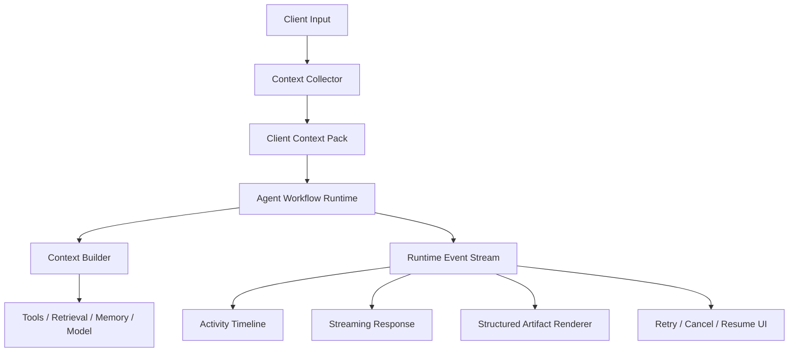
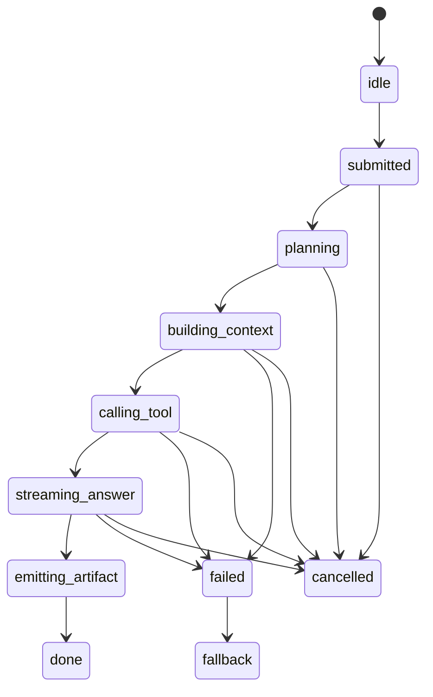
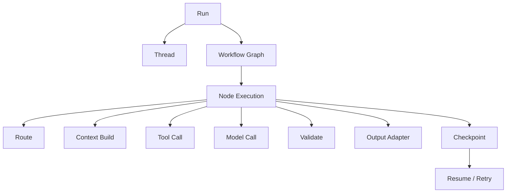
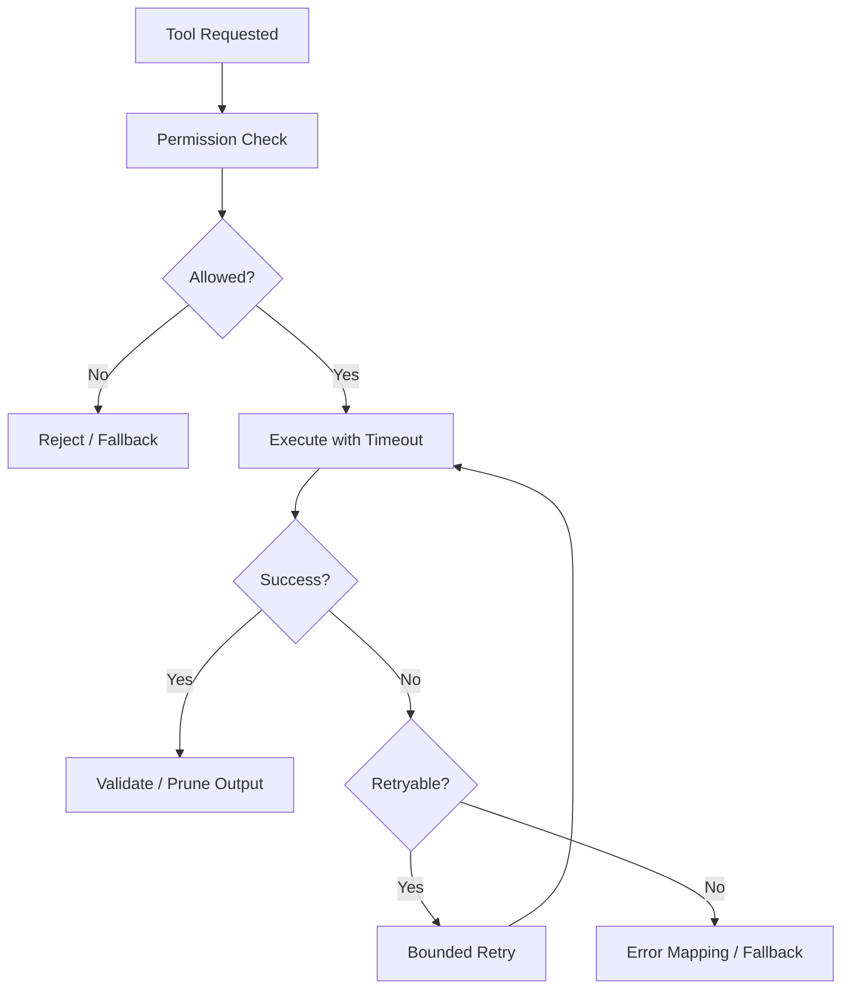
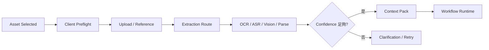

# Agent 終端與工作流 Runtime

[English](./02-agent-client-runtime.md) | [繁體中文](./02-agent-client-runtime-zh-TW.md)

本文件定義 Agent-enabled Client 如何採集 Context、接收 Runtime Event、渲染 Structured Artifact，並與可恢復的 Workflow Runtime 協作。

[返回模組首頁](../README-zh-TW.md)  
[上下文工程核心](./01-context-engineering-core-zh-TW.md)

## 1. Agent-enabled Client Architecture

Agent Client 是 Runtime 的參與者，負責採集狀態、消費事件並渲染 Artifact。



Client 應採集目前可見狀態、附加 Entity 與 Asset Reference、宣告 Capability、冪等消費 Event、維護確定性 State Machine、渲染通過驗證的 Artifact，並支援取消、重試、重連與恢復。

## 2. Client Context Pack

```ts
interface ClientContextPack {
  packId: string;
  threadId: string;
  scene: string;
  currentInput: CurrentInputContext;
  recentInteractions: InteractionContext[];
  assets: AssetContext[];
  artifacts: ArtifactContext[];
  session: SessionContext;
  profile?: ProfileContext;
  constraints: ContextConstraints;
}
```

```ts
interface CurrentInputContext {
  inputId: string;
  type: 'text' | 'image' | 'audio' | 'document' | 'mixed';
  text?: string;
  assetIds?: string[];
  clientTs: number;
}

interface InteractionContext {
  interactionId: string;
  role: 'user' | 'assistant' | 'system';
  contentType: 'text' | 'artifact' | 'image' | 'audio' | 'document';
  summary: string;
  createdAt: number;
  entityRefs?: EntityRef[];
}

interface ArtifactContext {
  artifactId: string;
  artifactType: string;
  summary: string;
  payloadRef?: string;
  state?: string;
  entityRefs?: EntityRef[];
}

interface EntityRef {
  type: string;
  id: string;
  role?: 'current' | 'previous' | 'reference_only';
}
```

優先傳送 Summary；只有指代解析需要時才加入最近原文。傳送 `summary + payloadRef + entityRefs`，不要傳大型權威 Payload。

```ts
interface SessionContext {
  clientType: 'web' | 'native' | 'embedded' | 'desktop';
  timezone: string;
  locale: string;
  capabilities: {
    supportArtifactRender: boolean;
    supportDeepLink: boolean;
    supportVoiceInput: boolean;
    supportImageUpload: boolean;
    supportFileUpload: boolean;
  };
}

interface ContextConstraints {
  maxInputTokens: number;
  maxHistoryTurns: number;
  allowRetrieval: boolean;
  allowMemory: boolean;
  allowToolCall: boolean;
  allowSideEffects: boolean;
}
```

## 3. Runtime Event Protocol

Runtime Event 描述執行過程，並隔離模型的私有推理內容。

```ts
type AgentRuntimeEvent =
  | AgentRunStartedEvent
  | AgentPlanStartedEvent
  | AgentContextBuildEvent
  | AgentToolStartedEvent
  | AgentToolSuccessEvent
  | AgentToolErrorEvent
  | AgentAnswerStreamEvent
  | AgentArtifactEmitEvent
  | AgentFallbackEvent
  | AgentRunFinishedEvent;

interface BaseRuntimeEvent {
  eventId: string;
  runId: string;
  threadId: string;
  agentId: string;
  stepId?: string;
  sequence: number;
  timestamp: number;
}
```

```ts
interface AgentRunStartedEvent extends BaseRuntimeEvent {
  type: 'agent.run.started';
  inputType: 'text' | 'image' | 'audio' | 'document' | 'mixed';
  scene: string;
}
interface AgentPlanStartedEvent extends BaseRuntimeEvent {
  type: 'agent.plan.started';
  title: string;
  intent?: string;
}
interface AgentContextBuildEvent extends BaseRuntimeEvent {
  type: 'agent.context.build';
  contextPackId: string;
  sources: string[];
  tokenEstimate: number;
}
interface AgentToolStartedEvent extends BaseRuntimeEvent {
  type: 'agent.tool.started';
  toolName: string;
  publicLabel: string;
}
interface AgentToolSuccessEvent extends BaseRuntimeEvent {
  type: 'agent.tool.success';
  toolName: string;
  costMs: number;
  outputPreview?: unknown;
}
interface AgentToolErrorEvent extends BaseRuntimeEvent {
  type: 'agent.tool.error';
  toolName: string;
  errorCode: string;
  retryable: boolean;
}
interface AgentAnswerStreamEvent extends BaseRuntimeEvent {
  type: 'agent.answer.stream';
  delta: string;
}
interface AgentArtifactEmitEvent extends BaseRuntimeEvent {
  type: 'agent.artifact.emit';
  artifact: AgentArtifactViewModel;
}
interface AgentFallbackEvent extends BaseRuntimeEvent {
  type: 'agent.fallback';
  reason: string;
  userMessage: string;
}
interface AgentRunFinishedEvent extends BaseRuntimeEvent {
  type: 'agent.run.finished';
  status: 'success' | 'failed' | 'cancelled' | 'fallback';
  totalCostMs: number;
  inputTokens?: number;
  outputTokens?: number;
}
```

約束：

- `eventId` 支援冪等消費。
- `sequence` 支援亂序重排與重連。
- Payload 可安全顯示。
- 不能暴露 Prompt、Secret、Raw Tool Payload 與 Hidden Reasoning。
- 完成後的 Run 可由 Durable Event 或 Checkpoint 回放。

## 4. Streaming State Machine

```ts
type AgentMessageState =
  | 'idle'
  | 'submitted'
  | 'planning'
  | 'building_context'
  | 'calling_tool'
  | 'streaming_answer'
  | 'emitting_artifact'
  | 'done'
  | 'failed'
  | 'fallback'
  | 'cancelled';
```



Reducer 必須處理重複 Event、事件亂序、重連、Step Retry、用戶取消、Stale Event，以及 Answer 完成後才到達的 Artifact。

## 5. Activity Timeline

```ts
interface ActivityTimelineItem {
  id: string;
  runId: string;
  stepId?: string;
  type: 'plan' | 'context' | 'tool' | 'answer' | 'artifact' | 'fallback' | 'error';
  title: string;
  description?: string;
  status: 'pending' | 'running' | 'success' | 'error' | 'skipped';
  startedAt: number;
  endedAt?: number;
  metadata?: Record<string, unknown>;
}
```

例子：

```text
正在理解請求
正在選擇 Repository Context
正在執行驗證
正在產生 Patch
正在驗證 Structured Output
已產生 Code Artifact
```

Timeline 是執行摘要，不能展示 Hidden Chain-of-thought。

## 6. Workflow Execution Model



```ts
interface AgentRun {
  runId: string;
  threadId: string;
  agentId: string;
  workflowId: string;
  status: AgentRunStatus;
  input: unknown;
  output?: unknown;
  startedAt: number;
  finishedAt?: number;
  steps: AgentStep[];
  checkpoints: AgentCheckpoint[];
}

type AgentRunStatus =
  | 'queued'
  | 'running'
  | 'waiting_tool'
  | 'streaming'
  | 'success'
  | 'failed'
  | 'cancelled'
  | 'fallback';

interface AgentStep {
  stepId: string;
  nodeId: string;
  nodeType: 'router' | 'context_builder' | 'tool' | 'model' | 'validator' | 'output_adapter' | 'fallback';
  status: 'pending' | 'running' | 'success' | 'failed' | 'skipped' | 'retrying' | 'cancelled';
  startedAt?: number;
  finishedAt?: number;
  error?: AgentRuntimeError;
}

interface AgentCheckpoint {
  checkpointId: string;
  runId: string;
  stepId: string;
  stateSnapshotRef: string;
  createdAt: number;
  reason: 'before_tool' | 'after_tool' | 'before_model' | 'after_model' | 'manual' | 'error_recovery';
}
```

## 7. Tool Execution Lifecycle

```ts
interface ToolExecutionState {
  toolCallId: string;
  runId: string;
  stepId: string;
  toolName: string;
  status: 'pending' | 'running' | 'success' | 'failed' | 'timeout' | 'cancelled' | 'fallback';
  argsHash: string;
  startedAt?: number;
  finishedAt?: number;
  retryCount: number;
  outputRef?: string;
  error?: AgentRuntimeError;
}
```

Tool Executor 應強制 Timeout、Bounded Retry、Cancellation、Output Validation、Result Pruning、Idempotency、Permission Check、必要的 User Confirmation 與 Fallback Mapping。



## 8. Structured Artifact Renderer

```ts
interface AgentArtifactViewModel {
  artifactId: string;
  artifactType:
    | 'information'
    | 'status'
    | 'table'
    | 'form'
    | 'action'
    | 'citation'
    | 'code'
    | 'approval'
    | 'fallback';
  schemaVersion: string;
  title: string;
  data: Record<string, unknown>;
  actions?: ArtifactAction[];
  traceId: string;
}

interface ArtifactAction {
  type: 'navigate' | 'copy' | 'retry' | 'submit' | 'approve' | 'reject' | 'open';
  label: string;
  payload: Record<string, unknown>;
}
```

| Layer | 責任 |
|---|---|
| Model | 產生領域語意與候選字段 |
| Validator | 驗證 Schema、Enum、必填字段與風險約束 |
| Output Adapter | 依 Client Capability 映射資料與 Action |
| Renderer | 展示，不重新推斷營運狀態 |

## 9. 多模態 Client Flow



傳送 Reference 與 Extracted Metadata，不要在每個 Prompt 中塞入任意 Raw Media。

## 10. Cancel、Retry、Resume 與 Fallback

| 能力 | 必要行為 |
|---|---|
| Cancel | 傳遞 Abort Signal，停止非必要工作 |
| Retry | 只重試可重試 Step，且次數有上限 |
| Resume | 從 Durable Checkpoint 或 Event Sequence 恢復 |
| Timeout | 讓 Step 可預期地失敗並映射安全狀態 |
| Fallback | 提供安全替代方案、澄清或人工路徑 |

適合建立 Checkpoint 的時機：昂貴 Tool 成功後、Model Call 前、Model Output 後但 Validation 前、Side Effect 前、用戶批准後。

## 11. Runtime Debugging

```text
Run
├── Route
├── Context: selected / excluded sources, tokens, compression
├── Tools: status, latency, retry count
├── Model: time to first token, total latency
└── Output: schema, validation, artifact rendering
```

不能暴露 Secret、Raw Private Data、完整 Internal Prompt 或 Hidden Reasoning。

## 12. 最小可運行縱向鏈路

```text
使用者詢問某個資源目前狀態
→ Client Context Pack
→ Rule-based Route Decision
→ Read-only Tool
→ Pruned Tool Result
→ Model Explanation
→ Status Artifact
→ Runtime Timeline
→ Trace
```

最小實作順序：

1. Client Context Pack
2. Rule-based Routing
3. Context Builder
4. Mock Read-only Tool
5. Runtime Event Stream
6. Structured Artifact Renderer
7. Error 與 Fallback State
8. Debug Panel
9. Evaluation Cases

驗收：

- Plan、Context、Tool、Response、Artifact 與 Finish Event 可見
- Tool Timeout 產生確定性 Fallback
- 重複 Event 不造成重複 UI
- Reconnect 從最後 Sequence 恢復
- Tool Output 送入模型前已裁剪
- Artifact 通過 Schema Validation
- Trace 記錄 Route、Sources、Tokens、Latency 與 Fallback Reason
