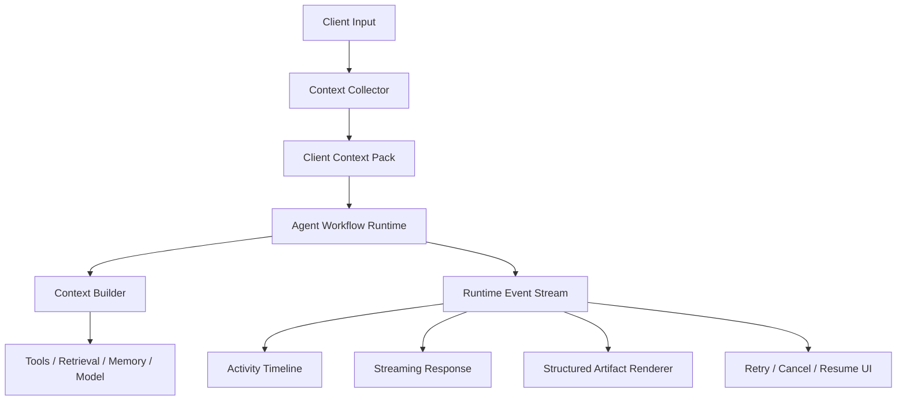
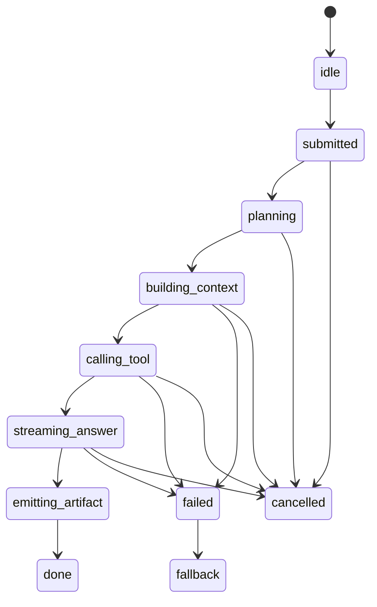
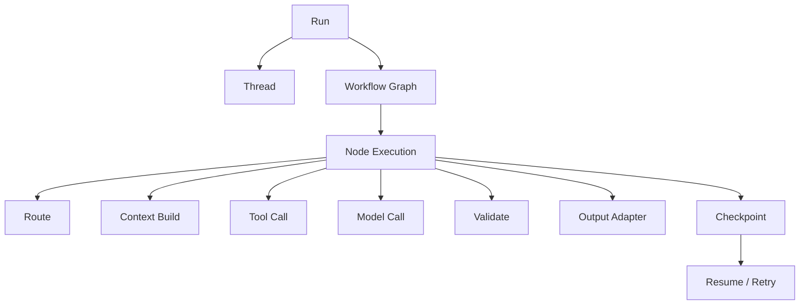
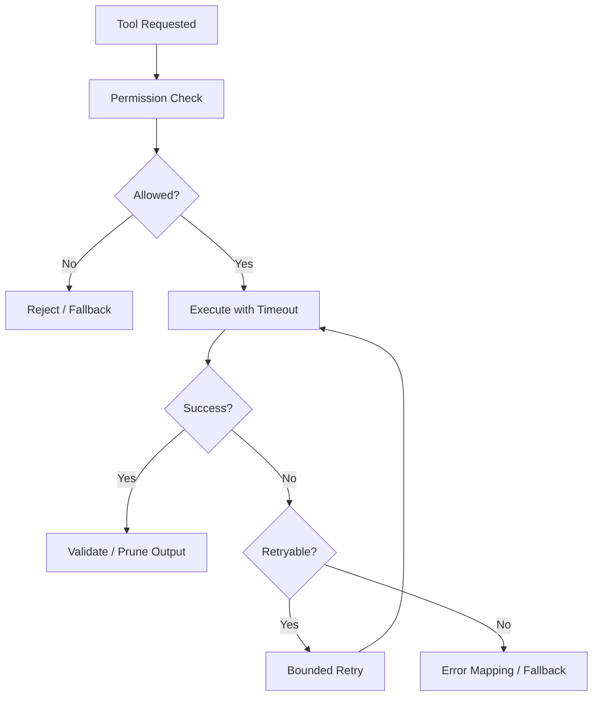
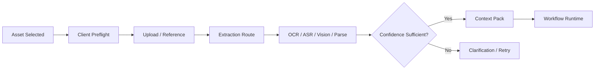

# Agent Client & Workflow Runtime

[English](./02-agent-client-runtime.md) | [繁體中文](./02-agent-client-runtime-zh-TW.md)

This document defines how an agent-enabled client collects context, receives runtime events, renders structured artifacts, and interacts with a resumable workflow runtime.

[Back to module overview](../README.md)  
[Context Engineering Core](./01-context-engineering-core.md)

## 1. Agent-enabled Client Architecture

An agent client participates in runtime execution by collecting state, consuming events, and rendering artifacts.



The client should collect visible state, attach entity and asset references, declare capabilities, consume idempotent events, maintain a deterministic state machine, render validated artifacts, and support cancellation, retry, reconnection, and resume.

## 2. Client Context Pack

```ts
interface ClientContextPack {
  packId: string;
  threadId: string;
  scene: string;
  currentInput: CurrentInputContext;
  recentInteractions: InteractionContext[];
  assets: AssetContext[];
  artifacts: ArtifactContext[];
  session: SessionContext;
  profile?: ProfileContext;
  constraints: ContextConstraints;
}
```

```ts
interface CurrentInputContext {
  inputId: string;
  type: 'text' | 'image' | 'audio' | 'document' | 'mixed';
  text?: string;
  assetIds?: string[];
  clientTs: number;
}

interface InteractionContext {
  interactionId: string;
  role: 'user' | 'assistant' | 'system';
  contentType: 'text' | 'artifact' | 'image' | 'audio' | 'document';
  summary: string;
  createdAt: number;
  entityRefs?: EntityRef[];
}

interface ArtifactContext {
  artifactId: string;
  artifactType: string;
  summary: string;
  payloadRef?: string;
  state?: string;
  entityRefs?: EntityRef[];
}

interface EntityRef {
  type: string;
  id: string;
  role?: 'current' | 'previous' | 'reference_only';
}
```

Prefer summaries. Add raw recent content only when reference resolution requires it. Send `summary + payloadRef + entityRefs`, not large authoritative payloads.

```ts
interface SessionContext {
  clientType: 'web' | 'native' | 'embedded' | 'desktop';
  timezone: string;
  locale: string;
  capabilities: {
    supportArtifactRender: boolean;
    supportDeepLink: boolean;
    supportVoiceInput: boolean;
    supportImageUpload: boolean;
    supportFileUpload: boolean;
  };
}

interface ContextConstraints {
  maxInputTokens: number;
  maxHistoryTurns: number;
  allowRetrieval: boolean;
  allowMemory: boolean;
  allowToolCall: boolean;
  allowSideEffects: boolean;
}
```

## 3. Runtime Event Protocol

Runtime events describe execution while keeping private model reasoning hidden.

```ts
type AgentRuntimeEvent =
  | AgentRunStartedEvent
  | AgentPlanStartedEvent
  | AgentContextBuildEvent
  | AgentToolStartedEvent
  | AgentToolSuccessEvent
  | AgentToolErrorEvent
  | AgentAnswerStreamEvent
  | AgentArtifactEmitEvent
  | AgentFallbackEvent
  | AgentRunFinishedEvent;

interface BaseRuntimeEvent {
  eventId: string;
  runId: string;
  threadId: string;
  agentId: string;
  stepId?: string;
  sequence: number;
  timestamp: number;
}
```

```ts
interface AgentRunStartedEvent extends BaseRuntimeEvent {
  type: 'agent.run.started';
  inputType: 'text' | 'image' | 'audio' | 'document' | 'mixed';
  scene: string;
}

interface AgentPlanStartedEvent extends BaseRuntimeEvent {
  type: 'agent.plan.started';
  title: string;
  intent?: string;
}

interface AgentContextBuildEvent extends BaseRuntimeEvent {
  type: 'agent.context.build';
  contextPackId: string;
  sources: string[];
  tokenEstimate: number;
}

interface AgentToolStartedEvent extends BaseRuntimeEvent {
  type: 'agent.tool.started';
  toolName: string;
  publicLabel: string;
}

interface AgentToolSuccessEvent extends BaseRuntimeEvent {
  type: 'agent.tool.success';
  toolName: string;
  costMs: number;
  outputPreview?: unknown;
}

interface AgentToolErrorEvent extends BaseRuntimeEvent {
  type: 'agent.tool.error';
  toolName: string;
  errorCode: string;
  retryable: boolean;
}

interface AgentAnswerStreamEvent extends BaseRuntimeEvent {
  type: 'agent.answer.stream';
  delta: string;
}

interface AgentArtifactEmitEvent extends BaseRuntimeEvent {
  type: 'agent.artifact.emit';
  artifact: AgentArtifactViewModel;
}

interface AgentFallbackEvent extends BaseRuntimeEvent {
  type: 'agent.fallback';
  reason: string;
  userMessage: string;
}

interface AgentRunFinishedEvent extends BaseRuntimeEvent {
  type: 'agent.run.finished';
  status: 'success' | 'failed' | 'cancelled' | 'fallback';
  totalCostMs: number;
  inputTokens?: number;
  outputTokens?: number;
}
```

Requirements:

- `eventId` supports idempotent consumption.
- `sequence` supports reordering and reconnection.
- payloads are safe for client display.
- prompts, secrets, raw tool payloads, and hidden reasoning are not exposed.
- a finished run can be replayed from durable events or checkpoints.

## 4. Streaming State Machine

```ts
type AgentMessageState =
  | 'idle'
  | 'submitted'
  | 'planning'
  | 'building_context'
  | 'calling_tool'
  | 'streaming_answer'
  | 'emitting_artifact'
  | 'done'
  | 'failed'
  | 'fallback'
  | 'cancelled';
```



The reducer must handle duplicate events, out-of-order events, reconnection, retrying steps, user cancellation, stale events, and artifacts arriving after answer completion.

## 5. Activity Timeline

```ts
interface ActivityTimelineItem {
  id: string;
  runId: string;
  stepId?: string;
  type: 'plan' | 'context' | 'tool' | 'answer' | 'artifact' | 'fallback' | 'error';
  title: string;
  description?: string;
  status: 'pending' | 'running' | 'success' | 'error' | 'skipped';
  startedAt: number;
  endedAt?: number;
  metadata?: Record<string, unknown>;
}
```

Example:

```text
Understanding the request
Selecting repository context
Running validation
Generating a patch
Validating structured output
Emitting a code artifact
```

The timeline is an execution summary and must not expose hidden chain-of-thought.

## 6. Workflow Execution Model



```ts
interface AgentRun {
  runId: string;
  threadId: string;
  agentId: string;
  workflowId: string;
  status: AgentRunStatus;
  input: unknown;
  output?: unknown;
  startedAt: number;
  finishedAt?: number;
  steps: AgentStep[];
  checkpoints: AgentCheckpoint[];
}

type AgentRunStatus =
  | 'queued'
  | 'running'
  | 'waiting_tool'
  | 'streaming'
  | 'success'
  | 'failed'
  | 'cancelled'
  | 'fallback';

interface AgentStep {
  stepId: string;
  nodeId: string;
  nodeType:
    | 'router'
    | 'context_builder'
    | 'tool'
    | 'model'
    | 'validator'
    | 'output_adapter'
    | 'fallback';
  status: 'pending' | 'running' | 'success' | 'failed' | 'skipped' | 'retrying' | 'cancelled';
  startedAt?: number;
  finishedAt?: number;
  error?: AgentRuntimeError;
}

interface AgentCheckpoint {
  checkpointId: string;
  runId: string;
  stepId: string;
  stateSnapshotRef: string;
  createdAt: number;
  reason: 'before_tool' | 'after_tool' | 'before_model' | 'after_model' | 'manual' | 'error_recovery';
}
```

## 7. Tool Execution Lifecycle

```ts
interface ToolExecutionState {
  toolCallId: string;
  runId: string;
  stepId: string;
  toolName: string;
  status: 'pending' | 'running' | 'success' | 'failed' | 'timeout' | 'cancelled' | 'fallback';
  argsHash: string;
  startedAt?: number;
  finishedAt?: number;
  retryCount: number;
  outputRef?: string;
  error?: AgentRuntimeError;
}
```

A tool executor should enforce timeout, bounded retry, cancellation, output validation, result pruning, idempotency, permission checks, user confirmation when required, and fallback mapping.



## 8. Structured Artifact Renderer

```ts
interface AgentArtifactViewModel {
  artifactId: string;
  artifactType:
    | 'information'
    | 'status'
    | 'table'
    | 'form'
    | 'action'
    | 'citation'
    | 'code'
    | 'approval'
    | 'fallback';
  schemaVersion: string;
  title: string;
  data: Record<string, unknown>;
  actions?: ArtifactAction[];
  traceId: string;
}

interface ArtifactAction {
  type: 'navigate' | 'copy' | 'retry' | 'submit' | 'approve' | 'reject' | 'open';
  label: string;
  payload: Record<string, unknown>;
}
```

| Layer | Responsibility |
|---|---|
| Model | produce domain meaning and candidate fields |
| Validator | validate schema, enums, required fields, risk constraints |
| Output Adapter | map data and actions to client capabilities |
| Renderer | display without reinterpreting operational state |

## 9. Multimodal Client Flow



Send references and extracted metadata, not arbitrary raw media in every prompt.

## 10. Cancel, Retry, Resume, and Fallback

| Capability | Required Behavior |
|---|---|
| Cancel | propagate an abort signal and stop non-essential work |
| Retry | retry only retryable steps with bounded attempts |
| Resume | restart from a durable checkpoint or event sequence |
| Timeout | fail predictably and map to a user-safe state |
| Fallback | offer a safe alternative, clarification, or human path |

Useful checkpoints include after an expensive tool succeeds, before a model call, after model output but before validation, before a side effect, and after explicit approval.

## 11. Runtime Debugging

```text
Run
├── Route
├── Context: selected and excluded sources, tokens, compression
├── Tools: status, latency, retry count
├── Model: time to first token, total latency
└── Output: schema, validation, artifact rendering
```

Never expose secrets, raw private data, full internal prompts, or hidden reasoning.

## 12. Runnable Vertical Slice

```text
User asks for the current state of a resource
→ Client Context Pack
→ rule-based Route Decision
→ read-only Tool
→ pruned Tool Result
→ model explanation
→ status Artifact
→ Runtime Timeline
→ Trace
```

Minimal implementation order:

1. Client Context Pack
2. rule-based routing
3. Context Builder
4. mock read-only tool
5. runtime event stream
6. Structured Artifact Renderer
7. error and fallback states
8. debug panel
9. evaluation cases

Acceptance criteria:

- plan, context, tool, response, artifact, and finish events are visible
- tool timeout produces deterministic fallback
- duplicate events do not duplicate UI state
- reconnect resumes from the last sequence
- tool output is pruned before model use
- artifacts pass schema validation
- trace records route, sources, tokens, latency, and fallback reason
