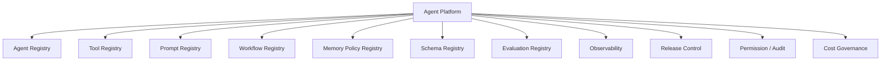
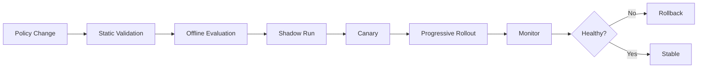
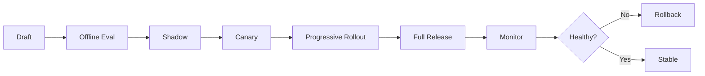
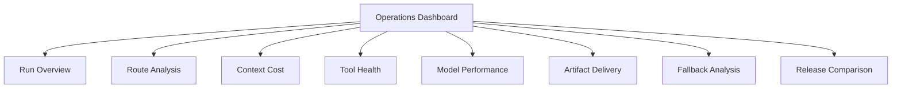

# Agent 平台營運與治理

[English](./03-agent-platform-operations.md) | [繁體中文](./03-agent-platform-operations-zh-TW.md)

本文件定義 Context Policy、Agent、Tool、Prompt、Workflow、Schema、Eval、Release 與營運控制如何被平台化管理。

[返回模組首頁](../README-zh-TW.md)  
[上下文工程核心](./01-context-engineering-core-zh-TW.md)  
[Agent 終端與工作流 Runtime](./02-agent-client-runtime-zh-TW.md)

## 1. Platform Architecture



Runtime Configuration 應有版本、可 Review、可測試、可觀測、可發布、可回滾，並有明確 Owner。

## 2. ContextOps

ContextOps 管理：

- Route Policy
- Context Builder
- Prompt Modules
- Retrieval Configuration
- Memory Policy
- Tool Descriptor 與 Schema
- Disclosure Policy
- Token Budget
- Evaluation Cases

任何變更都可能改變模型行為，因此應視為 Release。



## 3. Registries

### 3.1 Agent Registry

```ts
interface AgentRegistryItem {
  agentId: string;
  name: string;
  capabilityDomain: string;
  version: string;
  owner: string;
  workflowId: string;
  promptPolicyId: string;
  memoryPolicyId: string;
  toolSetId: string;
  evaluationDatasetId: string;
  outputSchemaIds: string[];
  status: 'draft' | 'testing' | 'canary' | 'online' | 'deprecated';
  createdAt: number;
  updatedAt: number;
}
```

### 3.2 Tool Registry

```ts
interface ToolDefinition {
  toolName: string;
  domain: string;
  description: string;
  inputSchemaId: string;
  outputSchemaId: string;
  riskLevel: 'low' | 'medium' | 'high';
  sideEffect: 'none' | 'read' | 'write' | 'external_action';
  timeoutMs: number;
  retryPolicyId: string;
  permissionPolicyId: string;
  fallbackPolicyId: string;
  owner: string;
  version: string;
}
```

### 3.3 Prompt Registry

```ts
interface PromptRegistryItem {
  promptId: string;
  name: string;
  domain: string;
  version: string;
  contentRef: string;
  variables: string[];
  outputSchemaId?: string;
  evaluationDatasetId?: string;
  owner: string;
  status: 'draft' | 'testing' | 'online' | 'deprecated';
}
```

### 3.4 Workflow Registry

```ts
interface WorkflowRegistryItem {
  workflowId: string;
  name: string;
  version: string;
  graphDefinitionRef: string;
  timeoutPolicyId: string;
  retryPolicyId: string;
  checkpointPolicyId: string;
  owner: string;
  status: 'draft' | 'testing' | 'online' | 'deprecated';
}
```

### 3.5 Memory Policy Registry

```ts
interface MemoryPolicyRegistryItem {
  memoryPolicyId: string;
  name: string;
  version: string;
  allowedMemoryRoutes: string[];
  writePolicy: {
    allowProfileWrite: boolean;
    allowRecentSummaryWrite: boolean;
    allowVectorWrite: boolean;
    sensitiveFields: string[];
  };
  readPolicy: {
    maxProfileFields: number;
    maxRecentSummaryTokens: number;
    maxSlidingWindowTurns: number;
    maxVectorTopK: number;
  };
  owner: string;
}
```

### 3.6 Schema Registry

儲存 Tool Input/Output、Client Context Pack、Runtime Event、Structured Artifact、Evaluation Record 與 Trace Payload 的 Versioned Schema，發布前檢查 Compatibility。

### 3.7 Evaluation Dataset Registry

```ts
interface EvaluationDataset {
  datasetId: string;
  name: string;
  domain: string;
  version: string;
  cases: EvaluationCase[];
  metrics: string[];
  owner: string;
  updatedAt: number;
}

interface EvaluationCase {
  caseId: string;
  input: unknown;
  expectedRoute?: Partial<RouteDecision>;
  expectedTool?: string;
  expectedSources?: string[];
  expectedOutput?: unknown;
  prohibitedBehavior?: string[];
  riskLevel: 'low' | 'medium' | 'high';
  tags: string[];
}
```

## 4. Observability 與 Trace

一次 Run Trace 應串接 Client、Context、Workflow、Tool、Model、Artifact 與 Cost。

```ts
interface AgentRunTrace {
  runId: string;
  threadId: string;
  agentId: string;
  workflowId: string;
  scene: string;
  routeTrace: RouteTrace;
  contextTrace: ContextTrace;
  stepTraces: StepTrace[];
  toolTraces: ToolTrace[];
  modelTraces: ModelTrace[];
  outputTrace: OutputTrace;
  uiTrace?: UiTrace;
  costTrace: CostTrace;
  createdAt: number;
}
```

```ts
interface RouteTrace {
  queryRoute: string;
  domainRoute?: string;
  sourceRoutes: string[];
  retrievalRoute?: string;
  memoryRoutes?: string[];
  toolRoute?: string;
  outputRoute: string;
  confidence: number;
}

interface ContextTrace {
  contextPackId: string;
  builderVersion: string;
  inputTokens: number;
  sources: Array<{
    sourceType: string;
    tokenCount: number;
    included: boolean;
    reason: string;
  }>;
  compressionRatio?: number;
  progressiveExpansionLevel?: number;
}
```

追蹤 Tool/Model Status、Latency、Timeout、Retry、Input/Output Size、Model Name、TTFT、Validation、Fallback Reason、First Artifact Time、Render Success、Reconnect Count 與 Stale Event Count。

## 5. 營運指標

Runtime：Run Success、Latency Percentile、TTFT、Context-build Latency、Tool Success/Timeout、Checkpoint Resume、Artifact Render、Schema Validation Failure。

Context：Route Accuracy、Domain Mismatch、Source Overuse、Input Tokens by Route、Compression Ratio、Retrieval Precision/Recall、Memory Conflict、Progressive Expansion。

品質與安全：Faithfulness、Unsupported Claim、Policy Violation、High-risk Confirmation、Permission Denial、Fallback Success。

成本：Cost per Run/Route/Agent/Model/Tool、Retrieval Cost、Cache Savings、Retry Amplification、Abandoned-run Cost。

## 6. 評估策略

使用：

1. Contract Tests
2. Deterministic Route Tests
3. Retrieval Tests
4. Tool Simulation
5. Model-output Evaluation
6. End-to-end Replay
7. Shadow Traffic Analysis
8. Production Monitoring

最小案例群：正常、模糊輸入、Context 缺失、Memory 衝突、Knowledge 過期、Tool Timeout、Tool Output 無效、多模態低信心、Schema Failure、高風險 Side Effect、Cancel/Resume、重複與亂序 Event。

每項優化都要比較 Baseline 與 Candidate Policy。Token 降低只有在正確性與安全性維持不變時才算成功。

## 7. 權限與風險控制

高風險 Action 需要 Prompt 以外的控制。

```ts
interface PermissionPolicy {
  policyId: string;
  allowedAgents: string[];
  allowedScenes: string[];
  requiredScopes: string[];
  requireUserConfirmation: boolean;
  requireHumanApproval: boolean;
  maxRiskLevel: 'low' | 'medium' | 'high';
}
```

| Level | 例子 | Policy |
|---|---|---|
| low | Read-only Lookup | 在 Scope 內自動執行 |
| medium | Recommendation / Eligibility | Trace 並 Validate |
| high | Write、Approve、Publish、Transfer、Delete | 明確確認或人工批准 |

Side-effect Tool 應要求 Idempotency Key、Actor Identity、必要的 Approval Token、Audit Trace ID 與 Before/After State Reference。

## 8. Data Governance

Policy 應定義哪些資料可進 Prompt、可寫入 Memory、Retention、Redaction、Access Control、Export/Delete、Trace Replay Permission、Cross-region Restriction 與 Logging Exclusion。

Trace 應包含足以排查 Run 的資訊，但不要複製不必要的私有內容。

## 9. Release 與 Rollback



Release Unit 可能包含 Agent、Route Policy、Prompt、Workflow、Memory Policy、Tool Set、Schema、Model Configuration 與 Evaluation Dataset。Rollback 應以 Release Unit 為邊界，恢復一組相容配置。

## 10. Cost 與 Token Governance

可按 Request、Route、Agent、Environment、Tool、Model 與時間區間設定 Budget。

限制 Maximum Input/Output Tokens、Retrieval Chunks、Tool Calls、Retries、Disclosure Level 與 Run Duration。

對 Cost Spike、Retry Amplification、Source Overuse、Route 變更造成 Token 上升、Cache Hit 下降與昂貴 Abandoned Run 告警。

## 11. Dashboard Views



建議 Drill-down：

```text
Environment → Agent → Version → Route → Workflow → Step → Tool/Model/Artifact → Trace
```

## 12. 成熟度模型

| Level | 狀態 | 證據 |
|---|---|---|
| L0 Architecture | 已文件化 | Contract、Diagram、Authority Rule |
| L1 Runnable PoC | 可執行 | 一條 Vertical Slice 端到端運作 |
| L2 Observable Runtime | 可追蹤 | Event、Trace、Debug Panel、Error State |
| L3 Evaluated System | 可量測 | Dataset、Baseline、Route/Context Metrics |
| L4 Governed Production | 可治理 | Permission、Release、Rollback、Audit、Budget |

只有文件屬於 L0。營運成熟度應由可執行程式、測試、Trace 與量測結果支撐。

## 13. 導入路線

Phase 1：Client Context Pack、Rule-based Route、Context Builder、一個 Read-only Tool、Structured Artifact、Trace。

Phase 2：Runtime Event、State Reducer、Activity Timeline、Cancel、Retry、Fallback、Reconnect。

Phase 3：Recent Summary、Memory/Retrieval Route、Progressive Disclosure、Token 與品質評估。

Phase 4：Checkpoint、Resume、Tool Permission、Side-effect Idempotency、Replay。

Phase 5：Registry、Eval Gate、Canary、Rollback、Cost Budget、Audit。

## 14. 建議倉庫演進

文件起點：

```text
context-engineering/
├─ README.md
├─ docs/
├─ patterns/
└─ templates/
```

可執行 Package：

```text
packages/
├─ contracts/
├─ context-runtime/
├─ agent-runtime/
├─ tool-runtime/
└─ client-runtime/
```

Eval：

```text
evals/
├─ route-cases.jsonl
├─ context-cases.jsonl
├─ tool-cases.jsonl
├─ output-cases.jsonl
└─ replay-cases.jsonl
```

## 15. 治理 Checklist

- [ ] Contract 與 Schema 已版本化
- [ ] Eval Gate 通過
- [ ] 高風險 Tool 需要 Permission
- [ ] Side Effect 具備 Idempotency
- [ ] Context Data 已 Redact 且授權
- [ ] Token 與 Cost Budget 已設定
- [ ] Shadow / Canary 結果已 Review
- [ ] Rollback 可恢復相容配置組
- [ ] Trace 可安全檢視
- [ ] Owner 與營運路徑已定義
