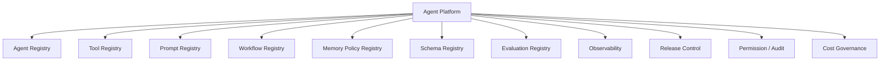
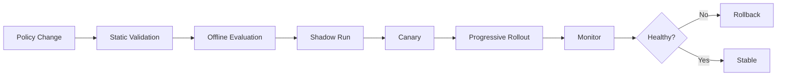
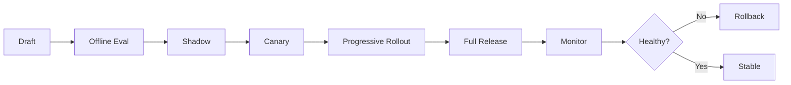
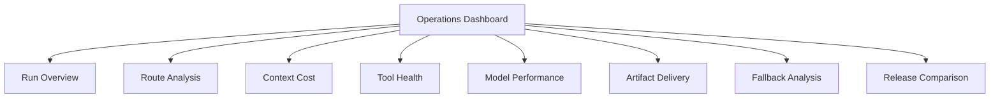

# Agent Platform Operations & Governance

[English](./03-agent-platform-operations.md) | [繁體中文](./03-agent-platform-operations-zh-TW.md)

This document defines how context policies, agents, tools, prompts, workflows, schemas, evaluations, releases, and operational controls can be managed as a platform.

[Back to module overview](../README.md)  
[Context Engineering Core](./01-context-engineering-core.md)  
[Agent Client & Workflow Runtime](./02-agent-client-runtime.md)

## 1. Platform Architecture



Runtime configuration should be versioned, reviewable, testable, observable, releasable, reversible, and owned.

## 2. ContextOps

ContextOps manages the lifecycle of:

- route policy
- Context Builder
- prompt modules
- retrieval configuration
- memory policy
- tool descriptors and schemas
- disclosure policy
- token budgets
- evaluation cases

A change to any of these may change model behavior and should be treated as a release.



## 3. Registries

### 3.1 Agent Registry

```ts
interface AgentRegistryItem {
  agentId: string;
  name: string;
  capabilityDomain: string;
  version: string;
  owner: string;
  workflowId: string;
  promptPolicyId: string;
  memoryPolicyId: string;
  toolSetId: string;
  evaluationDatasetId: string;
  outputSchemaIds: string[];
  status: 'draft' | 'testing' | 'canary' | 'online' | 'deprecated';
  createdAt: number;
  updatedAt: number;
}
```

### 3.2 Tool Registry

```ts
interface ToolDefinition {
  toolName: string;
  domain: string;
  description: string;
  inputSchemaId: string;
  outputSchemaId: string;
  riskLevel: 'low' | 'medium' | 'high';
  sideEffect: 'none' | 'read' | 'write' | 'external_action';
  timeoutMs: number;
  retryPolicyId: string;
  permissionPolicyId: string;
  fallbackPolicyId: string;
  owner: string;
  version: string;
}
```

### 3.3 Prompt Registry

```ts
interface PromptRegistryItem {
  promptId: string;
  name: string;
  domain: string;
  version: string;
  contentRef: string;
  variables: string[];
  outputSchemaId?: string;
  evaluationDatasetId?: string;
  owner: string;
  status: 'draft' | 'testing' | 'online' | 'deprecated';
}
```

### 3.4 Workflow Registry

```ts
interface WorkflowRegistryItem {
  workflowId: string;
  name: string;
  version: string;
  graphDefinitionRef: string;
  timeoutPolicyId: string;
  retryPolicyId: string;
  checkpointPolicyId: string;
  owner: string;
  status: 'draft' | 'testing' | 'online' | 'deprecated';
}
```

### 3.5 Memory Policy Registry

```ts
interface MemoryPolicyRegistryItem {
  memoryPolicyId: string;
  name: string;
  version: string;
  allowedMemoryRoutes: string[];
  writePolicy: {
    allowProfileWrite: boolean;
    allowRecentSummaryWrite: boolean;
    allowVectorWrite: boolean;
    sensitiveFields: string[];
  };
  readPolicy: {
    maxProfileFields: number;
    maxRecentSummaryTokens: number;
    maxSlidingWindowTurns: number;
    maxVectorTopK: number;
  };
  owner: string;
}
```

### 3.6 Schema Registry

Store versioned schemas for tool input/output, Client Context Pack, runtime events, structured artifacts, evaluation records, and trace payloads. Validate compatibility before release.

### 3.7 Evaluation Dataset Registry

```ts
interface EvaluationDataset {
  datasetId: string;
  name: string;
  domain: string;
  version: string;
  cases: EvaluationCase[];
  metrics: string[];
  owner: string;
  updatedAt: number;
}

interface EvaluationCase {
  caseId: string;
  input: unknown;
  expectedRoute?: Partial<RouteDecision>;
  expectedTool?: string;
  expectedSources?: string[];
  expectedOutput?: unknown;
  prohibitedBehavior?: string[];
  riskLevel: 'low' | 'medium' | 'high';
  tags: string[];
}
```

## 4. Observability and Tracing

A run trace should connect client, context, workflow, tool, model, artifact, and cost layers.

```ts
interface AgentRunTrace {
  runId: string;
  threadId: string;
  agentId: string;
  workflowId: string;
  scene: string;
  routeTrace: RouteTrace;
  contextTrace: ContextTrace;
  stepTraces: StepTrace[];
  toolTraces: ToolTrace[];
  modelTraces: ModelTrace[];
  outputTrace: OutputTrace;
  uiTrace?: UiTrace;
  costTrace: CostTrace;
  createdAt: number;
}
```

```ts
interface RouteTrace {
  queryRoute: string;
  domainRoute?: string;
  sourceRoutes: string[];
  retrievalRoute?: string;
  memoryRoutes?: string[];
  toolRoute?: string;
  outputRoute: string;
  confidence: number;
}

interface ContextTrace {
  contextPackId: string;
  builderVersion: string;
  inputTokens: number;
  sources: Array<{
    sourceType: string;
    tokenCount: number;
    included: boolean;
    reason: string;
  }>;
  compressionRatio?: number;
  progressiveExpansionLevel?: number;
}
```

Track tool/model status, latency, timeout, retries, input/output size, model name, time to first token, validation status, fallback reason, first artifact time, render success, reconnect count, and stale-event count.

## 5. Operational Metrics

Runtime:

- run success rate
- run latency percentiles
- time to first token
- context-build latency
- tool success and timeout rates
- checkpoint resume success rate
- artifact render success rate
- schema validation failure rate

Context:

- route accuracy
- domain mismatch rate
- source overuse rate
- input tokens by route
- compression ratio
- retrieval precision and recall
- memory conflict rate
- progressive expansion rate

Quality and safety:

- faithfulness
- unsupported claim rate
- policy violation rate
- high-risk action confirmation rate
- permission denial rate
- fallback success rate

Cost:

- cost per run, route, agent, model, and tool
- retrieval cost
- cache savings
- retry amplification
- abandoned-run cost

## 6. Evaluation Strategy

Use multiple layers:

1. contract tests
2. deterministic route tests
3. retrieval tests
4. tool simulation
5. model-output evaluation
6. end-to-end replay
7. shadow traffic analysis
8. production monitoring

Minimum case groups:

- normal cases
- ambiguous input
- missing context
- conflicting memory
- stale knowledge
- tool timeout
- invalid tool output
- low-confidence multimodal extraction
- schema failure
- high-risk side effect
- cancellation and resume
- duplicate and out-of-order events

Every optimization should compare the existing baseline with a candidate policy. Token reduction counts only when correctness and safety hold.

## 7. Permissions and Risk Controls

High-risk actions require controls outside the model prompt.

```ts
interface PermissionPolicy {
  policyId: string;
  allowedAgents: string[];
  allowedScenes: string[];
  requiredScopes: string[];
  requireUserConfirmation: boolean;
  requireHumanApproval: boolean;
  maxRiskLevel: 'low' | 'medium' | 'high';
}
```

| Level | Example | Policy |
|---|---|---|
| low | read-only lookup | automatic within scope |
| medium | recommendation or eligibility calculation | trace and validate |
| high | write, approve, publish, transfer, delete | explicit confirmation or human approval |

Side-effecting tools should require an idempotency key, actor identity, approval token when required, audit trace identifier, and before/after state references.

## 8. Data Governance

Policies should define:

- what data may enter a prompt
- what data may be stored in memory
- retention duration
- redaction rules
- access control
- export and deletion behavior
- trace replay permissions
- cross-region restrictions
- logging exclusions

A trace should contain enough information to debug a run without copying unnecessary private content.

## 9. Release and Rollback



Release units may include agent version, route policy, prompt version, workflow graph, memory policy, tool set, schema version, model configuration, and evaluation dataset. A rollback should use the release unit as its boundary and restore a compatible set.

## 10. Cost and Token Governance

Set budgets per request, route, agent, environment, tool, model, and time period.

Policies may limit:

- maximum input and output tokens
- maximum retrieval chunks
- maximum tool calls and retries
- maximum disclosure level
- maximum run duration

Alert on cost spikes, retry amplification, source overuse, token growth after route changes, cache degradation, and expensive abandoned runs.

## 11. Dashboard Views



Recommended drill-down:

```text
environment → agent → version → route → workflow → step → tool/model/artifact → trace
```

## 12. Maturity Model

| Level | State | Evidence |
|---|---|---|
| L0 Architecture | documented | contracts, diagrams, authority rules |
| L1 Runnable PoC | executable | one vertical slice works end to end |
| L2 Observable Runtime | traceable | events, traces, debug panel, error states |
| L3 Evaluated System | measurable | datasets, baselines, route/context metrics |
| L4 Governed Production | controlled | permission, release, rollback, audit, budgets |

A document alone is L0. Operational maturity should be backed by executable code, tests, traces, and measured results.

## 13. Adoption Roadmap

Phase 1 — Vertical Slice:

- Client Context Pack
- rule-based route
- Context Builder
- one read-only tool
- structured artifact
- trace

Phase 2 — Client Runtime:

- runtime event protocol
- state reducer
- Activity Timeline
- cancel, retry, fallback
- reconnect

Phase 3 — Context Quality:

- Recent Summary
- memory and retrieval routes
- progressive disclosure
- token and quality evaluation

Phase 4 — Runtime Durability:

- checkpoints and resume
- tool permissions
- side-effect idempotency
- replay

Phase 5 — Platform Governance:

- registries
- evaluation gates
- canary release
- rollback
- cost budgets
- audit

## 14. Suggested Repository Evolution

Documentation can start under:

```text
context-engineering/
├─ README.md
├─ docs/
├─ patterns/
└─ templates/
```

Executable packages may later use:

```text
packages/
├─ contracts/
├─ context-runtime/
├─ agent-runtime/
├─ tool-runtime/
└─ client-runtime/
```

And evaluations:

```text
evals/
├─ route-cases.jsonl
├─ context-cases.jsonl
├─ tool-cases.jsonl
├─ output-cases.jsonl
└─ replay-cases.jsonl
```

## 15. Governance Checklist

- [ ] contracts and schemas are versioned
- [ ] evaluation gates pass
- [ ] high-risk tools require permission
- [ ] side effects are idempotent
- [ ] context data is redacted and authorized
- [ ] token and cost budgets are configured
- [ ] shadow or canary results are reviewed
- [ ] rollback restores a compatible configuration set
- [ ] traces are safe to view
- [ ] owners and operational paths are defined
