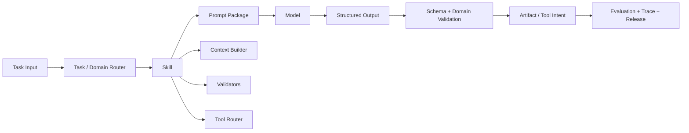

# AI Agent Prompt Engineering

[English](./README.md) | [繁體中文](./README-zh-TW.md)

這是一套可重用的 Prompt Engineering 參考工程，用來把提示詞文字整理成可版本化、可評估、可發布、可觀測、可回復的工程資產。

> 本工程記錄的是參考架構。
> 所有情境、識別碼、payload、範例與指標都是合成資料。
> 導入正式環境前，仍需完成領域驗證、安全審查、評估、隱私控管與營運防護。

## 本工程涵蓋什麼

本工程把 Prompt 視為**模型輸入協議**，而不是孤立的提示詞文案，並連接：

- Domain 與 Skill 邊界；
- Prompt Package 與結構化契約；
- Prompt 污染預防；
- Prompt Injection 防護；
- 離線資產治理；
- 線上 workflow 執行；
- 評估、成本、追蹤、canary release 與 rollback；
- YAML manifest 與可重現的 `prompt-lock.json` 快照。



## 核心原則

```text
把 Prompt 當成協議，而不是散文。
讓 Domain 負責語意邊界。
讓 Skill 負責工程邊界。
先 routing，再組裝 context。
先產生結構化 spec，再產生最終 artifact。
用 schema 保護結構，用 validator 保護領域語意。
區分 Prompt 污染與 Prompt Injection。
讓工程師操作 workflow 與 skill，而不是直接操作未受控的正式 Prompt。
讓每個 Prompt Package 都可評估、可發布、可觀測、可回復。
```

## 文件地圖

1. [Prompt Engineering 系統](./docs/01-prompt-engineering-system-zh-TW.md)  
   完整參考架構，涵蓋 Prompt Package、Domain、Skill、routing、workflow、評估、版本、lockfile、release 與 rollback。

2. [English: Prompt Engineering System](./docs/01-prompt-engineering-system.md)

## 可重用範本

| 檔案 | 用途 |
|---|---|
| [`prompt-manifest.example.yaml`](./templates/prompt-manifest.example.yaml) | 宣告 Prompt Package 與它的契約、政策、範例、評估案例與 validator。 |
| [`workflow.example.yaml`](./templates/workflow.example.yaml) | 宣告離線與 runtime workflow，不把業務邏輯塞進 YAML。 |
| [`domain-registry.example.yaml`](./templates/domain-registry.example.yaml) | 將穩定 domain 對應到 skill、state enum、禁用值、validator 與風險等級。 |
| [`prompt-lock.example.json`](./templates/prompt-lock.example.json) | 示範可重現評估與發布用的 dependency snapshot。 |

## 完整 Prompt Package 範例

[`prompts/structured-artifact-generation/`](./prompts/structured-artifact-generation/) 內含一個完整的合成 Prompt Package：

```text
structured-artifact-generation/
├── prompt.md
├── prompt-zh-TW.md
├── prompt.yaml
├── input.schema.json
├── output.schema.json
├── examples.yaml
├── eval-cases.yaml
└── prompt-lock.json
```

這個 package 實作一個合成 domain：`offer_card`。它的負面評估案例會刻意注入另一個 `entitlement_card` domain 的 state 與 action，用來示範 domain isolation 與 contamination detection，但不會把兩個 domain 放進同一個正式 Prompt Package。

## 建議閱讀順序

```text
README
-> Prompt 作為模型輸入協議
-> Prompt Package
-> Domain / Skill / Router 邊界
-> 離線治理
-> Runtime Workflow
-> 評估與成本
-> YAML Manifest 與 Lockfile
-> Canary 與 Rollback
```

## 如何導入

1. 將 `prompt-engineering/` 複製到 repository root。
2. 先閱讀系統文件，再重用範本。
3. 以合成 Prompt Package 作為起點。
4. 將 domain、schema、example 與 validator 換成經審查的專案資產。
5. 實作或接上一個能理解 YAML node type 的 runner。
6. 在 CI 產生 lockfile，不要手動編輯。
7. 正式使用前加入 evaluation gate 與 release gate。

## 範圍

本工程涵蓋：

- Prompt Package 結構；
- Domain 與 Skill isolation；
- 結構化 input / output contract；
- 兩階段 artifact generation；
- 工程團隊使用的 workflow governance；
- Prompt contamination 與 Prompt Injection；
- token 與品質評估；
- SemVer、manifest、lockfile、canary 與 rollback 實務。

## 非目標

本工程不是：

- 可直接上線的 hosted prompt platform；
- 完整 workflow runner；
- domain authorization 的替代品；
- 模型輸出正確性的保證；
- 讓 secret 或 private data 暴露給模型的理由；
- 安全、隱私、法務與可靠性控管的替代方案。

## 授權與調整

這些檔案設計成可複製、可調整。請讓合成範例與正式資料保持清楚分離，並在目標環境中驗證每個 schema、policy、model、tool 與 release process。
