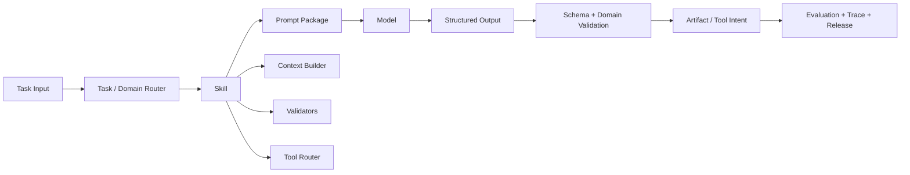

# Prompt Engineering for AI Agents

[English](./README.md) | [繁體中文](./README-zh-TW.md)

A reusable Prompt Engineering reference project for turning prompt text into versioned, evaluable, releasable, observable, and reversible engineering assets.

> This project documents a reference architecture.
> All scenarios, identifiers, payloads, examples, and metrics are synthetic.
> Production adoption still requires domain validation, security review, evaluation, privacy controls, and operational safeguards.

## What This Project Covers

This project treats a prompt as a **model input protocol**, not as isolated copywriting. It connects:

- domain and skill boundaries;
- prompt packages and structured contracts;
- prompt contamination prevention;
- prompt injection defenses;
- offline asset governance;
- online workflow execution;
- evaluation, cost, tracing, canary release, and rollback;
- YAML manifests and reproducible `prompt-lock.json` snapshots.



## Core Principles

```text
Treat prompts as protocols, not prose.
Let domains own semantic boundaries.
Let skills own engineering boundaries.
Route before assembling context.
Generate a structured spec before a final artifact.
Use schemas for structure and validators for domain semantics.
Separate prompt contamination from prompt injection.
Let engineers operate workflows and skills, not unrestricted production prompts.
Make every prompt package evaluable, releasable, observable, and reversible.
```

## Documentation Map

1. [Prompt Engineering System](./docs/01-prompt-engineering-system.md)  
   Full reference architecture covering prompt packages, domains, skills, routing, workflows, evaluation, versioning, lockfiles, release, and rollback.

2. [繁體中文：Prompt Engineering 系統](./docs/01-prompt-engineering-system-zh-TW.md)

## Reusable Templates

| File | Purpose |
|---|---|
| [`prompt-manifest.example.yaml`](./templates/prompt-manifest.example.yaml) | Declares a prompt package and its contracts, policies, examples, evaluation cases, and validators. |
| [`workflow.example.yaml`](./templates/workflow.example.yaml) | Declares an offline and runtime workflow without embedding business logic in YAML. |
| [`domain-registry.example.yaml`](./templates/domain-registry.example.yaml) | Maps stable domains to skills, state enums, forbidden values, validators, and risk levels. |
| [`prompt-lock.example.json`](./templates/prompt-lock.example.json) | Demonstrates a generated dependency snapshot for reproducible evaluation and release. |

## Complete Prompt Package Example

[`prompts/structured-artifact-generation/`](./prompts/structured-artifact-generation/) contains a complete synthetic Prompt Package:

```text
structured-artifact-generation/
├── prompt.md
├── prompt-zh-TW.md
├── prompt.yaml
├── input.schema.json
├── output.schema.json
├── examples.yaml
├── eval-cases.yaml
└── prompt-lock.json
```

The package implements one synthetic domain, `offer_card`. Its negative evaluation cases deliberately inject states and actions from a separate `entitlement_card` domain to demonstrate domain isolation and contamination detection without placing both domains in one production Prompt Package.

## Suggested Reading Path

```text
README
-> Prompt as Model Input Protocol
-> Prompt Package
-> Domain / Skill / Router Boundaries
-> Offline Governance
-> Runtime Workflow
-> Evaluation and Cost
-> YAML Manifest and Lockfile
-> Canary and Rollback
```

## How to Adopt

1. Copy `prompt-engineering/` into the repository root.
2. Read the system document before reusing the templates.
3. Copy the synthetic Prompt Package as a starting point.
4. Replace domains, schemas, examples, and validators with reviewed project-specific assets.
5. Implement or connect a runner that understands your YAML node types.
6. Generate the lockfile in CI instead of editing it manually.
7. Add evaluation and release gates before production use.

## Scope

This project covers:

- prompt package structure;
- domain and skill isolation;
- structured input and output contracts;
- two-stage artifact generation;
- workflow governance for engineering teams;
- prompt contamination and prompt injection;
- token and quality evaluation;
- SemVer, manifest, lockfile, canary, and rollback practices.

## Non-goals

This project is not:

- a production-ready hosted prompt platform;
- a complete workflow runner;
- a replacement for domain authorization;
- a guarantee that model output is correct;
- a reason to expose secrets or private data to a model;
- a substitute for security, privacy, legal, and reliability controls.

## License and Adaptation

The files are designed to be copied and adapted. Keep synthetic examples clearly separated from production data, and validate every schema, policy, model, tool, and release process in the target environment.
