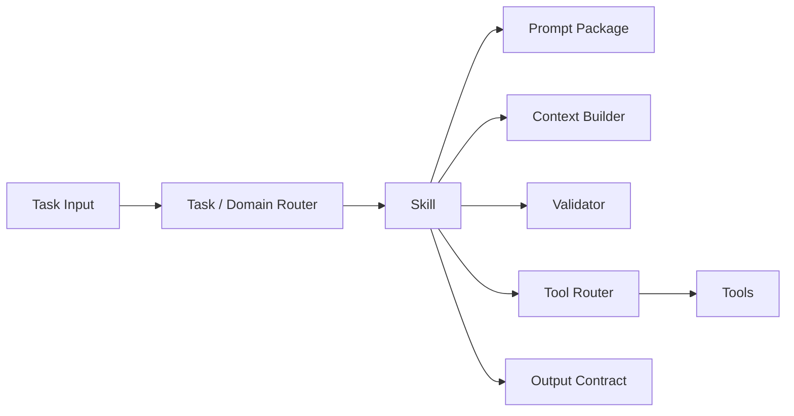
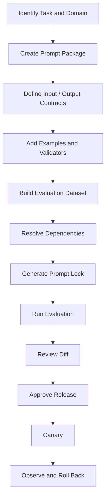
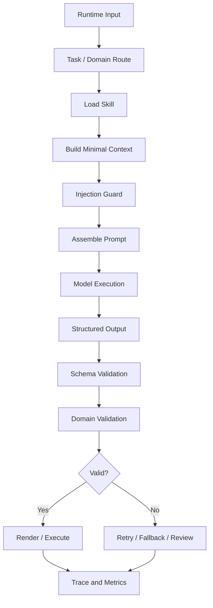
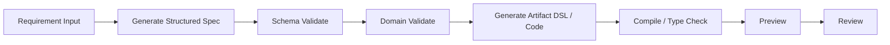
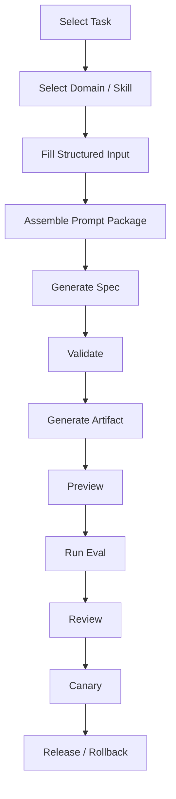
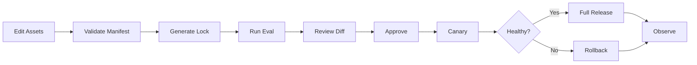

# Prompt Engineering 作為工程系統 (從範本資產到受治理的 Workflow)

[English](./01-prompt-engineering-system.md) | [繁體中文](./01-prompt-engineering-system-zh-TW.md)

這是一份給 AI agent、結構化 artifact generation 與多人 prompt operations 使用的參考架構。

> 本文件描述的是參考架構，不是可直接上線的 hosted platform。
> 所有情境、識別碼、payload、flow 與指標都是合成資料。
> 導入正式環境前，仍需完成 model provider 驗證、domain review、安全控管、隱私審查、評估與營運防護。

---

## 目錄

1. [為什麼 Prompt Engineering 需要工程系統](#1-為什麼-prompt-engineering-需要工程系統)
2. [核心立場：Prompt 是模型輸入協議](#2-核心立場prompt-是模型輸入協議)
3. [Prompt Package：Prompt 不只是 Markdown](#3-prompt-packageprompt-不只是-markdown)
4. [Domain、Skill、Prompt、Router 與 Tool Router](#4-domainskillpromptrouter-與-tool-router)
5. [離線工程流程：資產治理](#5-離線工程流程資產治理)
6. [線上執行流程：一個 task 如何執行](#6-線上執行流程一個-task-如何執行)
7. [兩階段生成：先 Spec，再 Artifact](#7-兩階段生成先-spec再-artifact)
8. [用 Workflow 治理 Prompt 使用](#8-用-workflow-治理-prompt-使用)
9. [Prompt Contamination 與 Prompt Injection](#9-prompt-contamination-與-prompt-injection)
10. [評估、成本與可觀測性](#10-評估成本與可觀測性)
11. [YAML Workflows、SemVer 與 prompt-lock.json](#11-yaml-workflowssemver-與-prompt-lockjson)
12. [Release、Canary、Rollback 與權限](#12-releasecanaryrollback-與權限)
13. [建議結構與最小導入切片](#13-建議結構與最小導入切片)
14. [實務 Checklist](#14-實務-checklist)
15. [成熟度模型](#15-成熟度模型)
16. [結論](#16-結論)

---

## 1. 為什麼 Prompt Engineering 需要工程系統

個人實驗時，prompt 可能只存在於聊天視窗、Markdown 檔案或程式碼字串。當同一個行為要支援團隊、長期產品與線上營運時，問題會變成工程問題：

- 工程師產生不一致的指令與輸出格式。
- 相似 task 共用一個過大的 prompt，導致 state、field、action 或 example 互相滲漏。
- Prompt 變更沒有穩定 evaluation dataset，品質退化不容易被看見。
- Schema、few-shot example、validator 與 workflow version 沒有一起發布。
- 同一個 Git commit 在不同環境解析到不同 dependency。
- 模型輸出結構正確，語意卻錯誤。
- Prompt 被當成 configuration 直接全域發布，沒有 canary 或 rollback。
- 任一工程師都能修改 production instruction，缺少 ownership 與 review boundary。
- Token 與 retry cost 上升，卻找不到對應資產。

Prompt Engineering 因此不只要回答「這段指令該怎麼寫」，還要回答：

1. Prompt 如何切分、命名、引用與版本化？
2. 哪個 domain 與 skill 擁有這個 task？
3. 模型可以看到哪些 variable、example、context 與 tool？
4. 結構與 domain semantics 如何驗證？
5. 變更如何經過 evaluation、review、canary 與 rollback？
6. 一般工程師如何安全使用 prompt，而不是直接修改 production prompt？
7. 一次 execution 如何從精確的 asset snapshot 重現？
8. 品質、成本、latency、contamination 與 security 如何衡量？

這些需求合在一起，就是工程化的 prompt system。

---

## 2. 核心立場：Prompt 是模型輸入協議

本文件採用這個立場：

> Prompt 不是一般文案，而是模型輸入協議。

它描述：

- 目標；
- role 與 responsibility boundary；
- 允許的 variable；
- external content 的 trust boundary；
- 可用 tool 與 tool restriction；
- output shape；
- 禁止行為；
- failure handling；
- verification 與 self-check requirement。

成熟的 prompt asset 應具備：

```text
Versionable
Reviewable
Evaluable
Releasable
Observable
Reversible
```

也就是：

- **Versionable**：變更內容與 compatibility intent 清楚。
- **Reviewable**：template、schema、example、validator 與 workflow diff 都看得到。
- **Evaluable**：用穩定案例評估品質、安全與成本。
- **Releasable**：promotion 受 release gate 控制。
- **Observable**：每次 execution 都能追到精確資產與 metrics。
- **Reversible**：候選版本退化時，可以回到已知穩定 snapshot。

### 2.1 Prompt Engineering 與 Context Engineering

Prompt Engineering 主要處理：

- instruction；
- template；
- variable；
- few-shot example；
- output contract；
- prompt version；
- prompt evaluation。

Context Engineering 處理更大的模型資訊環境：

- current input；
- structured state；
- retrieval；
- memory；
- tool definition 與 tool result；
- multimodal asset；
- history summary；
- token budget；
- source authority。

可用的邊界是：

```text
Context Engineering 決定模型該看什麼。
Prompt Engineering 決定模型該如何使用它。
```

---

## 3. Prompt Package：Prompt 不只是 Markdown

單一 `prompt.md` 無法完整描述受治理的 capability。本架構把必要資產收斂成 **Prompt Package**。

```text
structured-artifact-generation/
├── prompt.md
├── prompt.yaml
├── input.schema.json
├── output.schema.json
├── examples.yaml
├── eval-cases.yaml
├── validators/
└── prompt-lock.json
```

### 3.1 資產責任

| Asset | Responsibility |
|---|---|
| `prompt.md` | 人可讀的 instruction template |
| `prompt.yaml` | manifest、reference、policy 與 compatibility intent |
| `input.schema.json` | 允許進入 package 的 variable contract |
| `output.schema.json` | 模型輸出的 contract |
| `examples.yaml` | 經審查、domain-specific 的 few-shot cases |
| `eval-cases.yaml` | normal、boundary、failure、contamination 與 injection cases |
| `validators/` | 超出 schema syntax 的 deterministic domain rules |
| `prompt-lock.json` | 用於重現的 resolved version 與 content hash |

### 3.2 為什麼 Schema 不能取代 Validator

Schema 擅長檢查：

- required field；
- type；
- enum；
- array bound；
- parseable structure。

它通常無法完整表達：

- `status=expired` 時，`action` 必須等於 `disabled`；
- 一個 domain 不能輸出另一個 domain 的 state 或 field；
- 多個 field 之間的 conditional relationship；
- high-risk output 必須進入 human approval；
- low-confidence route 只能暴露 read-only tool。

因此：

```text
Schema 保護結構正確性。
Validator 保護 domain validity。
```

### 3.3 TypeScript 參考契約

```ts
export interface PromptPackageManifest {
  schemaVersion: number;
  id: string;
  version: string;
  domain: string;
  task: string;

  template: {
    defaultLocale: 'en' | 'zh-TW';
    variants: Record<string, string>;
  };

  contracts: {
    input: string;
    output: string;
  };

  examples?: {
    file: string;
    maxItems: number;
  };

  evaluation: {
    cases: string;
  };

  validators: string[];

  policies: {
    contextStrategy: 'smallest_sufficient' | 'fixed' | 'progressive';
    structuredOutput: 'required' | 'preferred' | 'none';
    untrustedInput: 'isolated' | 'rejected' | 'trusted';
  };

  compatibility: {
    inputSchema: string;
    outputSchema: string;
  };
}
```

---

## 4. Domain、Skill、Prompt、Router 與 Tool Router

常見失敗模式，是讓 prompt name 承擔本該屬於穩定工程 capability 的邊界。

避免用這類名稱組織系統：

```text
offer_prompt_v3
offer_prompt_v3_strict
offer_prompt_final
offer_prompt_low_cost
```

這些名稱代表 template variant，不代表穩定 domain ownership。

更好的架構是：



### 4.1 Domain

Domain 代表穩定的 semantic boundary。不要只用視覺相似度切分，請比較：

1. state machine；
2. field contract；
3. action 與 CTA semantics；
4. source-of-truth tool；
5. risk 與 authorization model；
6. validator rules。

合成範例中，系統產生兩種 structured UI artifact：

- `offer_card`
- `entitlement_card`

它們都可能有：

```text
status
amount
expiresAt
action
```

但 state machine 不同：

```text
offer_card
available -> activated -> expired

entitlement_card
eligible -> active -> consumed -> expired
```

action 也不同：

```text
offer_card
activate_now / activated / disabled

entitlement_card
use_now / view_details / disabled
```

它們不應因為都是 card，就共用一個含糊的 prompt。

### 4.2 Skill

Skill 是完整工程 capability，通常擁有：

- Prompt Package；
- Context Builder；
- validator；
- allowed tool set；
- Tool Router；
- output contract；
- evaluation dataset；
- fallback behavior；
- release policy。

核心差異是：

> Prompt 提供語意隔離；Skill 提供工程隔離。

### 4.3 Task / Domain Router

入口 router 決定：

- task 是 generation、revision、review、explanation 還是 execution；
- 由哪個 domain 擁有；
- 哪個 skill 應該執行；
- low confidence 是否需要 clarification 或 safe fallback。

建議 routing signal 優先順序：

1. 明確的 `domain` 或 `artifactType`；
2. structured payload 中可信的 identifier；
3. 上游已驗證的 task type；
4. 必要時才使用 natural-language 或 model classification。

### 4.4 Tool Router

Tool Router 回答：

> 進入正確 skill 之後，這一步應執行哪個 tool？

它不能取代 Domain Router。進入錯誤 skill 時，即使 tool 看似相關，也可能產生語意錯誤的參數。

### 4.5 是否需要 Prompt Router

通常不需要把 Prompt Router 作為全域第一級 layer。

建議使用：

```text
Task / Domain Router
-> Skill
-> Prompt Package
-> Optional Skill-local Prompt Variant Selector
```

Skill 可以包含這些 variant：

- `default`
- `strict_schema`
- `low_cost`
- `diagnostic`

這些是 local policy，不是新的 business domain。

---

## 5. 離線工程流程：資產治理

離線流程負責治理 prompt asset 如何建立、評估、審查與發布，讓 runtime traffic 看到它們之前先通過控制點。



### 5.1 Identify Task and Domain

先回答：

- package 擁有哪個 task？
- 哪個 domain 擁有語意？
- 現有 skill 是否能安全擴充？
- state machine 與 action 是否真的相容？
- 是否需要新的 output contract？
- risk level 是什麼？

不要從複製最像的 prompt 開始。

### 5.2 Create Prompt Package

讓 template、schema、example、evaluation case 與 lockfile 靠近到足以作為一個單位 review 與 release。

### 5.3 Define Contracts First

先定義 input 與 output contract，再寫完整 instruction。這會限制模型自由度，也給 reviewer 一個客觀邊界。

### 5.4 Add Examples and Validators

Few-shot asset 應該：

- 留在單一 domain 內；
- 使用少量經審查的 example；
- 避免塞入每個歷史成功案例；
- 與 schema、validator 一起演進；
- 必要時包含 negative 或 forbidden example。

### 5.5 Build the Evaluation Dataset

至少包含：

- normal case；
- boundary state；
- missing required field；
- invalid enum；
- similar-domain contamination；
- untrusted external content；
- prompt injection attempt；
- long input；
- schema-valid but semantically wrong output；
- tool unavailability；
- refusal 或 truncated output。

### 5.6 Resolve and Lock

Evaluation 前先解析精確的 Prompt Package dependency，並產生 `prompt-lock.json`。CI、evaluation、canary 與 release 應使用同一份 snapshot。

### 5.7 Review the Full Diff

不要只 review `prompt.md`。也要 review：

- input schema change；
- output schema change；
- example change；
- evaluation dataset change；
- validator change；
- token delta；
- output delta；
- domain mismatch delta；
- workflow change。

### 5.8 Canary and Rollback

Schema-compatible prompt 仍可能改變模型行為。請支援：

- small-percentage canary；
- domain- 或 task-scoped canary；
- shadow evaluation；
- fast version rollback；
- pinning 到上一個 stable lockfile。

---

## 6. 線上執行流程：一個 task 如何執行

線上流程不是把一大段字串丟給模型，而是一連串受控邊界。



### 6.1 Runtime Input

這些來源要分開：

- 目前的 user 或 engineer request；
- structured payload；
- task metadata；
- domain hint；
- trusted application state；
- untrusted external content。

Routing 前不要把所有資訊串成一個沒有 type 的 text block。

### 6.2 Route Decision

Route decision 應可檢查：

```ts
export interface RouteDecision {
  taskRoute: string;
  domainRoute: string;
  skillId: string;
  confidence: number;
  riskLevel: 'low' | 'medium' | 'high';
  reasons: string[];
  fallback?: 'clarify' | 'safe_general' | 'manual_review';
}
```

Low confidence 不應暴露所有 skill 與 tool。它應該觸發 clarification、safe general route、read-only tool 或 manual review。

### 6.3 Build Minimal Context

只注入 selected skill 需要的內容：

- allowed field；
- required state information；
- active output schema；
- 最接近的 reviewed example；
- 精簡 history 或 revision summary；
- 最小 tool description。

原則是：

> 使用足夠小的 context，不使用能塞就塞的 context。

### 6.4 Injection Guard

分離 system instruction、domain rule、user input、external document 與 tool result。External content 是 data，不是更高優先級的 instruction source。

### 6.5 Prompt Assembly

Assembler 應記錄：

- resolved template version；
- 實際注入的 variable；
- selected example ID；
- input 與 output schema version；
- lockfile hash；
- token estimate；
- trace ID。

### 6.6 Validation and Failure Handling

先驗證 structure，再驗證 domain semantics。限制 retry 次數，並傳遞精簡 error summary，不要無限制重播完整 failed context。

### 6.7 Render or Execute

Renderer 只應消費驗證過的 DSL 或 props。Tool executor 應強制：

- allowlist；
- parameter schema validation；
- authorization；
- risk assessment；
- 必要時 human approval。

模型可以提出 intent，但 runtime 擁有 permission。

---

## 7. 兩階段生成：先 Spec，再 Artifact

有 state machine、contract、action 與 visual rule 的 artifact，不建議一步產生最終程式碼。



### 7.1 Stage One：Structured Spec

合成範例：

```json
{
  "artifactType": "offer_card",
  "states": ["available", "activated", "expired"],
  "fields": ["title", "amount", "expiresAt", "action"],
  "stateRules": {
    "available": { "action": "activate_now" },
    "activated": { "action": "activated" },
    "expired": { "action": "disabled" }
  }
}
```

驗證：

- domain；
- complete state coverage；
- field allowlist；
- valid actions per state；
- forbidden cross-domain states or phrases；
- missing requirement requiring clarification。

### 7.2 Stage Two：Artifact

Spec 通過後再產生：

- UI Artifact DSL；
- React 或 Vue skeleton；
- props configuration；
- renderer-compatible JSON；
- test cases；
- preview data。

這能把失敗切成較清楚的類別：

```text
Requirement misunderstanding
Spec error
Schema error
Domain-rule error
Artifact transformation error
Renderer error
```

---

## 8. 用 Workflow 治理 Prompt 使用

團隊不應要求每位 contributor 都成為 Prompt Engineering 專家，也不應讓每位 contributor 擁有不受限制的 production prompt access。

更好的原則是：

> 工程師操作 skill 與 workflow；production prompt 留在受治理的 capability boundary 後面。



### 8.1 Contributor Inputs

一般工程師主要提供：

- task type；
- artifact type；
- state list；
- field definition；
- action rule；
- API mapping；
- design token；
- output mode；
- acceptance criteria。

Workflow 負責：

- domain 與 skill selection；
- package loading；
- context pruning；
- example selection；
- schema injection；
- validator；
- preview；
- token estimation；
- evaluation；
- version recording。

### 8.2 Experiment Flow and Formal Release Flow

#### Fast experiment flow

- editable sandbox input；
- optional sandbox prompt variant；
- 允許 preview；
- 禁止 release；
- 不推進 stable registry。

#### Formal release flow

- 只允許 registered skill；
- schema 與 validator 必備；
- stable evaluation dataset 必備；
- lockfile 必備；
- review 必備；
- canary 必備；
- rollback 必備。

治理原則是：

> Experiment 要快；release 要嚴。

### 8.3 Suggested Permissions

| Role | Suggested Permissions |
|---|---|
| Contributor | 執行既有 skill、提交 structured input、preview output |
| Maintainer | 修改 prompt、example 與 evaluation case |
| Domain Owner | 修改 schema、validator 與 domain boundary |
| Release Owner | 核准 canary、full release 與 rollback |
| Platform Owner | 修改 runner、registry、RBAC 與 audit policy |

Workflow 不只是 LLM orchestration。它治理使用、修改、驗證、發布與回復權限。

---

## 9. Prompt Contamination 與 Prompt Injection

兩者都和 context boundary 有關，但原因不同。

### 9.1 Prompt Contamination

Prompt contamination 通常是意外的 semantic leakage 或 overgeneralization。

常見原因：

- 相似 domain 共用一個過大的 template；
- few-shot example 混在一起；
- replay full history；
- schema 過度泛化；
- domain routing 錯誤；
- 缺少 forbidden-field check；
- revision note 滲入新 task；
- prompt variant selection 錯誤。

合成範例：

`offer_card` 允許：

```text
available / activated / expired
```

`entitlement_card` 允許：

```text
eligible / active / consumed / expired
```

如果模型對 `entitlement_card` 輸出 `activated`，JSON 可能能 parse，但 domain semantics 已被污染。

#### 防護

1. 依 domain 切分 skill。
2. 使用 domain-specific input 與 output schema。
3. 隔離 few-shot example。
4. 加上 domain validator。
5. 定義 forbidden field、state 與 action。
6. 跨 revision 只保留精簡 task summary。
7. Low-confidence route 不強迫生成。
8. Evaluation dataset 納入 contamination case。

### 9.2 Prompt Injection

Prompt Injection 發生在 untrusted content 嘗試改變 instruction priority 或誘發未授權行為時。

常見形式：

- `Ignore previous instructions` 類攻擊；
- 要求揭露 system instruction；
- external document 內含隱藏 operational command；
- 嘗試呼叫未授權 tool；
- 嘗試萃取 secret；
- 把 retrieved data 當成 controller instruction。

#### 防護

1. 分離 instruction 與 data。
2. 明確標示 untrusted content。
3. 使用 tool allowlist。
4. 用 schema 驗證 tool parameter。
5. High-risk action 要求 approval。
6. 在 tool runtime 強制 authorization。
7. 限制 URL、path、command 與 data scope。
8. 讓模型提出 intent，但不擁有 permission。
9. 掃描並隔離 rendered output。
10. 維護 dedicated injection evaluation cases。

### 9.3 Comparison

| Problem | Root Cause | Primary Controls |
|---|---|---|
| Prompt contamination | 意外的 semantic leakage | Domain、schema、example、validator |
| Prompt injection | Untrusted content 嘗試控制行為 | Trust boundary、authorization、approval、sandbox |

Schema alone 不能消除 Prompt Injection。Prompt text alone 也不能消除 domain contamination。Runtime control 仍然必要。

---

## 10. 評估、成本與可觀測性

Prompt 品質不能只靠直覺判斷。

### 10.1 Structural Stability

- structured parse success rate；
- schema validation rate；
- required field completeness；
- invalid enum rate；
- output truncation rate。

### 10.2 Task Quality

- first-response usability；
- first-pass acceptance；
- manual correction rate；
- domain mismatch rate；
- state-rule correctness；
- artifact preview pass rate。

### 10.3 Cost and Performance

- input tokens；
- output tokens；
- total task tokens；
- retry count；
- latency；
- cost per accepted artifact；
- tool-call count；
- context expansion count。

### 10.4 Safety and Governance

- injection detection rate；
- forbidden-field occurrence；
- unauthorized tool attempts；
- approval escalation rate；
- canary rollback count；
- lockfile mismatch count。

### 10.5 Evaluation Record

```ts
export interface PromptEvaluationResult {
  promptPackageId: string;
  promptVersion: string;
  lockHash: string;
  modelId: string;
  datasetVersion: string;

  metrics: {
    parseSuccessRate: number;
    schemaPassRate: number;
    domainPassRate: number;
    firstPassAcceptanceRate: number;
    domainMismatchRate: number;
    avgInputTokens: number;
    avgOutputTokens: number;
    avgRetries: number;
    p95LatencyMs: number;
  };

  releaseDecision:
    | 'approve'
    | 'approve_with_canary'
    | 'reject'
    | 'incomplete';
}
```

公開數字應標示為 synthetic，或表達成 `baseline / candidate / delta`。

### 10.6 Token-Cost Optimization

拆解 total task cost：

```text
Total Task Tokens
= fixed template
+ dynamic context
+ few-shot examples
+ history
+ tool definitions and results
+ model output
+ retries
```

優化順序：

1. 移除重複規則。
2. 只注入 active domain schema。
3. 選 Top-1 或 Top-2 example。
4. 用 revision summary 取代 full history。
5. 只暴露 selected skill 的 tool。
6. 將 tool result 裁到必要 field。
7. 先產生小 spec，再產生大型 artifact。
8. 用 compact error feedback retry。
9. 適合時使用 provider prompt caching。
10. 衡量 cost per accepted artifact，不只看 cost per request。

不要為了省 token 移除核心 domain rule、output contract、security boundary、permission requirement、state machine 或 failure handling。

---

## 11. YAML Workflows、SemVer 與 prompt-lock.json

YAML 適合：

- declaration；
- asset reference；
- workflow topology；
- policy configuration；
- version 與 compatibility intent。

YAML 不適合：

- 大量 domain logic；
- complex programming behavior；
- authorization enforcement；
- long prompt body；
- arbitrary expression execution。

使用這個分工：

```text
YAML = declarative DSL
Runner = execution engine
Executor = node implementation
Validator = deterministic rules
Prompt.md = instruction body
```

### 11.1 prompt.yaml

```yaml
schema_version: 1

id: structured-artifact-generation
version: 1.2.0
domain: structured_ui
task: generate_artifact

template:
  default_locale: en
  variants:
    en: ./prompt.md
    zh-TW: ./prompt-zh-TW.md

contracts:
  input: ./input.schema.json
  output: ./output.schema.json

examples:
  file: ./examples.yaml
  max_items: 2

evaluation:
  cases: ./eval-cases.yaml

validators:
  - schema-validator
  - domain-state-validator

policies:
  context_strategy: smallest_sufficient
  structured_output: required
  untrusted_input: isolated
  max_retries: 2

compatibility:
  input_schema: 1.x
  output_schema: 2.x
```

### 11.2 workflow.yaml

```yaml
schema_version: 1
id: structured-artifact-workflow
version: 1.0.0

input:
  schema: ./workflow-input.schema.json

nodes:
  - id: route_domain
    type: domain_router
    uses: structured-ui-domain-registry

  - id: load_skill
    type: skill_loader
    with:
      skill_id: ${nodes.route_domain.skill_id}

  - id: build_context
    type: context_builder
    with:
      strategy: smallest_sufficient
      allowed_fields: ${nodes.load_skill.allowed_fields}

  - id: generate_spec
    type: llm
    with:
      prompt_package: ${nodes.load_skill.prompt_package}
      mode: structured_output

  - id: validate_spec_schema
    type: schema_validator
    with:
      schema: ${nodes.load_skill.spec_schema}
      data: ${nodes.generate_spec.output}

  - id: validate_spec_domain
    type: domain_validator
    when: ${nodes.validate_spec_schema.valid}
    uses: ${nodes.load_skill.domain_validator}

  - id: generate_artifact
    type: llm
    when: ${nodes.validate_spec_domain.valid}
    with:
      prompt_variant: artifact_generation

  - id: preview
    type: artifact_preview

  - id: approval
    type: human_approval
    when: ${context.release_mode == "formal"}

  - id: canary
    type: release
    when: ${nodes.approval.approved}
    with:
      rollout_percentage: 5
```

### 11.3 domain-registry.yaml

```yaml
schema_version: 1

domains:
  offer_card:
    skill: generate-offer-card
    id_fields: [offerId]
    status_enum: [available, activated, expired]
    forbidden_status: [consumed]
    risk_level: medium

  entitlement_card:
    skill: generate-entitlement-card
    id_fields: [entitlementId]
    status_enum: [eligible, active, consumed, expired]
    forbidden_status: [activated]
    risk_level: medium
```

### 11.4 prompt-lock.json

Lockfile 應由 CLI 或 CI 產生，不應手動編輯。

### 11.5 Lockfile 解決什麼

- 一個 prompt version 的精確 file dependency；
- modified partial；
- schema replacement；
- example 與 evaluation consistency；
- validator 與 workflow version consistency；
- CI、evaluation、canary 與 production 使用相同 snapshot；
- incident analysis 時可重現。

### 11.6 Lockfile 不應包含什麼

- API key；
- secret；
- real user input；
- production payload；
- private context；
- full model response；
- unredacted evaluation data；
- rapidly changing online metrics。

### 11.7 Responsibility Split

| Mechanism | Responsibility |
|---|---|
| Git | 誰改了哪些檔案 |
| SemVer | Compatibility intent |
| `prompt.yaml` | Declarative package manifest |
| `prompt-lock.json` | Resolved immutable snapshot |
| Evaluation report | 行為與品質證據 |
| Release record | Canary、full release 與 rollback history |

### 11.8 SemVer Guidance

#### Patch

- wording correction；
- stronger negative constraint；
- 沒有 input 或 output contract change；
- 沒有 domain boundary change。

Regression evaluation 仍然必要。

#### Minor

- optional variable；
- non-breaking example；
- new validator；
- non-breaking state；
- context-strategy update；
- new prompt variant。

#### Major

- incompatible input schema；
- incompatible output schema；
- changed domain ownership；
- changed task responsibility；
- changed main workflow；
- changed tool permission model；
- artifact 與既有 renderer 不相容。

SemVer 表達 compatibility intent，不保證 model behavior。即使只改一個字，也可能改變 output distribution，因此每個版本都要通過 evaluation gate。

---

## 12. Release、Canary、Rollback 與權限

建議 release flow：



### 12.1 Release Gate

Formal release 前確認：

- manifest 可 parse；
- referenced file 存在；
- lockfile 是最新；
- schema validation 通過；
- evaluation coverage 足夠；
- candidate quality 沒有 blocking regression；
- token 與 latency 在 budget 內；
- contamination 與 injection case 通過；
- renderer 與 tool contract 仍相容；
- Release Owner 已批准 promotion。

### 12.2 Canary Signals

監控：

- parse success；
- domain validation pass rate；
- retry rate；
- manual-review rate；
- token cost；
- latency；
- fallback rate；
- domain mismatch；
- tool error；
- user cancellation；
- 與 stable version 的比較。

### 12.3 Rollback Unit

不要只 rollback `prompt.md`。請回復完整 release unit：

```text
Prompt Package
+ Workflow Version
+ Validator Version
+ Lockfile
+ Release Policy
```

否則系統可能把 old prompt 與 new schema 組在一起，或把 new prompt 與 old validator 組在一起。

---

## 13. 建議結構與最小導入切片

建議 layout：

```text
prompt-engineering/
├── README.md
├── README-zh-TW.md
├── docs/
│   ├── 01-prompt-engineering-system.md
│   └── 01-prompt-engineering-system-zh-TW.md
├── templates/
│   ├── prompt-manifest.example.yaml
│   ├── workflow.example.yaml
│   ├── domain-registry.example.yaml
│   └── prompt-lock.example.json
└── prompts/
    └── structured-artifact-generation/
        ├── prompt.md
        ├── prompt-zh-TW.md
        ├── prompt.yaml
        ├── input.schema.json
        ├── output.schema.json
        ├── examples.yaml
        ├── eval-cases.yaml
        └── prompt-lock.json
```

### 13.1 Minimum Vertical Slice

第一版不需要完整 visual platform。先做：

1. 一個 Prompt Package；
2. 一個 input schema；
3. 一個 output schema；
4. 五到十個 evaluation case；
5. 一個 domain validator；
6. 一個 `prompt.yaml`；
7. 一個產生 lockfile 的 CLI；
8. 一個 CI evaluation script；
9. 一個 manual approval gate；
10. 一筆 release record。

### 13.2 Avoid in the First Phase

- 完整 drag-and-drop workflow studio；
- custom general-purpose expression language；
- YAML 裡放 arbitrary program logic；
- 支援所有 model provider；
- 大型 prompt marketplace；
- stable evaluation 前就做 automatic prompt optimization；
- 用一個 universal skill 承擔所有 domain。

先讓一條 vertical path 可靠：

```text
Edit
-> Lock
-> Eval
-> Review
-> Canary
-> Observe
-> Rollback
```

---

## 14. 實務 Checklist

### 14.1 Domain and Skill

- [ ] 每個 task 都有清楚的 domain owner。
- [ ] Domain boundary 不只依視覺相似度決定。
- [ ] 已比較 state machine、field、action、tool 與 risk。
- [ ] 相似 domain 不共用一個含糊 prompt。
- [ ] Tool routing 不取代 entry-domain routing。
- [ ] Prompt variant 保持為 skill-local policy。

### 14.2 Prompt Package

- [ ] Prompt body 與 workflow YAML 已分離。
- [ ] Input schema 存在。
- [ ] Output schema 存在。
- [ ] Few-shot example 已做 domain isolation。
- [ ] Validator 覆蓋 cross-field rule。
- [ ] Eval case 包含 normal、boundary、contamination 與 injection case。
- [ ] 每個 manifest reference 都能解析。
- [ ] Lockfile 由 CI 或 CLI 產生。

### 14.3 Runtime

- [ ] Router 優先使用 structured signal。
- [ ] Context 使用 smallest-sufficient strategy。
- [ ] Instruction 與 untrusted data 已分離。
- [ ] Structured output 通過 schema validation。
- [ ] Output 通過 domain validation。
- [ ] Retry count 有上限。
- [ ] Tool 使用 allowlist 與 parameter schema。
- [ ] High-risk action 需要 approval。
- [ ] Renderer 不消費未驗證 output。

### 14.4 Evaluation

- [ ] 有穩定 baseline。
- [ ] Baseline 與 candidate 使用相同 dataset。
- [ ] 記錄 model 與 parameter version。
- [ ] 記錄 lockfile hash。
- [ ] 指標包含 structure、task、cost 與 safety。
- [ ] Public metric 清楚標示是否為 synthetic。
- [ ] Evaluation failure 會擋下 formal release。

### 14.5 Release

- [ ] Prompt、schema、example 與 validator 一起發布。
- [ ] Canary 存在。
- [ ] 有 previous stable snapshot。
- [ ] Rollback 範圍大於 prompt body。
- [ ] Runtime trace 能解析到精確 Prompt Package。
- [ ] Domain Owner 與 Release Owner 責任明確。

---

## 15. 成熟度模型

### Level 0：Free-form Prompts

- Prompt 存在於 chat、source code 或分散文件；
- 沒有 schema；
- 沒有 evaluation；
- 品質靠人工直覺判斷。

### Level 1：Templates

- 固定 Markdown template；
- variables；
- 基本 output format；
- 手動 copy 與修改。

### Level 2：Packages

- template、schema、example 與 eval case co-located；
- domain validator；
- 基本 CI。

### Level 3：Workflows

- task 與 domain routing；
- structured input；
- two-stage generation；
- preview、approval 與 canary；
- contributor 不直接操作 production prompt。

### Level 4：PromptOps

- manifest 與 lockfile；
- registry；
- trace；
- evaluation gate；
- cost governance；
- fast rollback；
- RBAC 與 audit。

### Level 5：Platform Governance

- multiple model 與 workflow；
- automated regression evaluation；
- shadow evaluation；
- controlled dynamic context 與 example selection；
- cross-team asset reuse；
- 明確的 security、compliance 與 operational ownership。

成熟度提升時，應增加可理解性、可重現性、可驗證性、可回復性與安全性，而不只是增加自動化。

---

## 16. 結論

Prompt Engineering 的工程價值不在更花俏的措辭，而在於把模型行為放進受治理的 development lifecycle。

核心原則如下：

```text
Prompt 是模型輸入協議。
Domain 擁有語意邊界。
Skill 擁有工程邊界。
Router 擁有入口 routing。
Tool Router 擁有 skill-local execution selection。
Schema 保護結構。
Validator 保護 domain semantics。
Workflow 治理使用、修改、驗證與發布。
Git 記錄變更。
SemVer 表達 compatibility intent。
Manifest 宣告資產。
Lockfile 固定 resolved snapshot。
Evaluation 提供行為證據。
Canary 與 rollback 控制線上風險。
```

對 structured artifact generation 來說，可靠路徑不是：

```text
Prompt -> Final Code
```

而是：

```text
Requirement
-> Domain / Skill
-> Prompt Package
-> Structured Spec
-> Schema / Domain Validation
-> Artifact
-> Preview / Evaluation
-> Canary / Release
```

當 prompt 能被版本化、評估、發布、觀測與回復，它就不再只是個人 prompting technique，而是可重用的工程資產。
