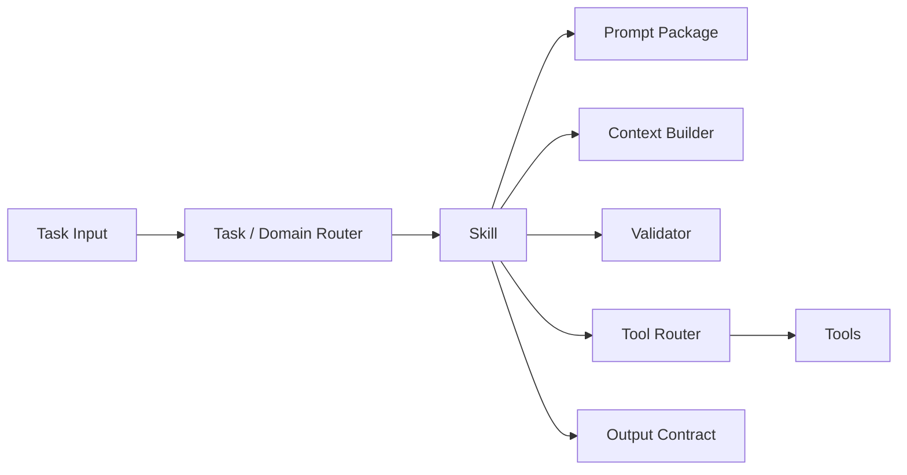
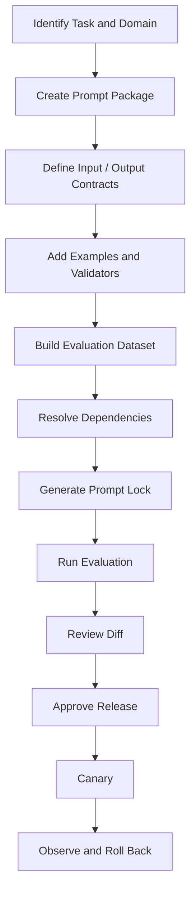
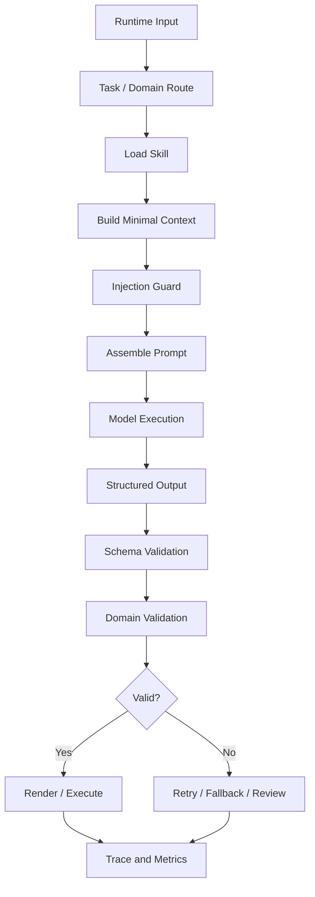
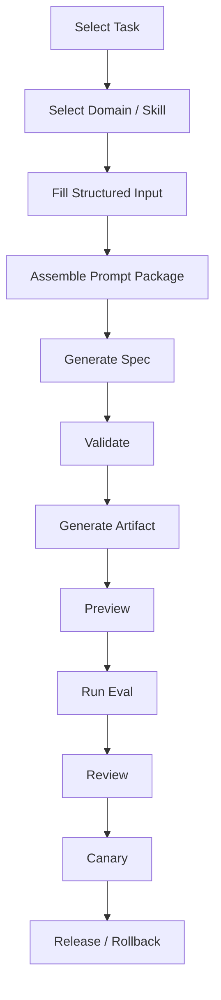
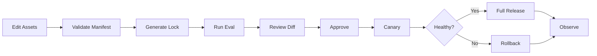

# Prompt Engineering as an Engineering System: From Template Assets to Governed Workflows

[English](./01-prompt-engineering-system.md) | [繁體中文](./01-prompt-engineering-system-zh-TW.md)

A reference architecture for AI agents, structured artifact generation, and multi-engineer prompt operations.

> This document describes a reference architecture, not a production-ready hosted platform.
> All scenarios, identifiers, payloads, flows, and metrics are synthetic.
> Production adoption still requires model-provider validation, domain review, security controls, privacy review, evaluation, and operational safeguards.

---

## Table of Contents

1. [Why Prompt Engineering Needs an Engineering System](#1-why-prompt-engineering-needs-an-engineering-system)
2. [Core Position: A Prompt Is a Model Input Protocol](#2-core-position-a-prompt-is-a-model-input-protocol)
3. [Prompt Package: A Prompt Is More Than Markdown](#3-prompt-package-a-prompt-is-more-than-markdown)
4. [Domain, Skill, Prompt, Router, and Tool Router](#4-domain-skill-prompt-router-and-tool-router)
5. [Offline Engineering Flow: Asset Governance](#5-offline-engineering-flow-asset-governance)
6. [Online Execution Flow: How One Task Runs](#6-online-execution-flow-how-one-task-runs)
7. [Two-Stage Generation: Spec Before Artifact](#7-two-stage-generation-spec-before-artifact)
8. [Using Workflow to Govern Prompt Usage](#8-using-workflow-to-govern-prompt-usage)
9. [Prompt Contamination and Prompt Injection](#9-prompt-contamination-and-prompt-injection)
10. [Evaluation, Cost, and Observability](#10-evaluation-cost-and-observability)
11. [YAML Workflows, SemVer, and prompt-lock.json](#11-yaml-workflows-semver-and-prompt-lockjson)
12. [Release, Canary, Rollback, and Permissions](#12-release-canary-rollback-and-permissions)
13. [Recommended Structure and Minimum Adoption Slice](#13-recommended-structure-and-minimum-adoption-slice)
14. [Practice Checklist](#14-practice-checklist)
15. [Maturity Model](#15-maturity-model)
16. [Conclusion](#16-conclusion)

---

## 1. Why Prompt Engineering Needs an Engineering System

During individual experimentation, a prompt may live in a chat window, a Markdown file, or a string literal. Once the same behavior must support a team, a long-lived product, and online operations, the problem changes:

- Engineers create inconsistent instructions and output formats.
- Similar tasks share one oversized prompt and leak states, fields, actions, or examples into each other.
- A prompt changes without a stable evaluation dataset, so quality regressions remain invisible.
- Schemas, few-shot examples, validators, and workflow versions are not released together.
- The same Git commit resolves to different dependencies across environments.
- Model output is structurally valid but semantically wrong.
- A prompt is treated as configuration and shipped globally without canary or rollback.
- Any engineer can modify production instructions without ownership or review boundaries.
- Token and retry cost increases, but the responsible asset cannot be identified.

Prompt Engineering must therefore answer more than "How should this instruction be phrased?" It must answer:

1. How are prompts split, named, referenced, and versioned?
2. Which domain and skill own a task?
3. Which variables, examples, context, and tools can the model see?
4. How are structure and domain semantics validated?
5. How does a change pass evaluation, review, canary, and rollback?
6. How can regular engineers use prompts safely without unrestricted production edits?
7. How can one execution be reproduced from an exact asset snapshot?
8. How are quality, cost, latency, contamination, and security measured?

Together, these concerns form an engineered prompt system.

---

## 2. Core Position: A Prompt Is a Model Input Protocol

This document uses the following position:

> A prompt is not ordinary copy. It is a model input protocol.

It describes:

- the objective;
- role and responsibility boundaries;
- allowed variables;
- trust boundaries for external content;
- available tools and tool restrictions;
- output shape;
- forbidden behavior;
- failure handling;
- verification and self-check requirements.

A mature prompt asset should be:

```text
Versionable
Reviewable
Evaluable
Releasable
Observable
Reversible
```

That means:

- **Versionable**: the change and compatibility intent are explicit.
- **Reviewable**: template, schema, example, validator, and workflow diffs are visible.
- **Evaluable**: stable cases measure quality, safety, and cost.
- **Releasable**: promotion is controlled by release gates.
- **Observable**: every execution can be traced to exact assets and metrics.
- **Reversible**: a degraded candidate can return to a known stable snapshot.

### 2.1 Prompt Engineering and Context Engineering

Prompt Engineering mainly handles:

- instructions;
- templates;
- variables;
- few-shot examples;
- output contracts;
- prompt versions;
- prompt evaluation.

Context Engineering handles the broader model information environment:

- current input;
- structured state;
- retrieval;
- memory;
- tool definitions and results;
- multimodal assets;
- history summaries;
- token budgets;
- source authority.

A useful boundary is:

```text
Context Engineering decides what the model should see.
Prompt Engineering decides how the model is instructed to use it.
```

---

## 3. Prompt Package: A Prompt Is More Than Markdown

A single `prompt.md` cannot fully describe a governed capability. This architecture groups the required assets into a **Prompt Package**.

```text
structured-artifact-generation/
├── prompt.md
├── prompt.yaml
├── input.schema.json
├── output.schema.json
├── examples.yaml
├── eval-cases.yaml
├── validators/
└── prompt-lock.json
```

### 3.1 Asset Responsibilities

| Asset | Responsibility |
|---|---|
| `prompt.md` | Human-readable instruction template |
| `prompt.yaml` | Manifest, references, policies, and compatibility intent |
| `input.schema.json` | Contract for variables allowed into the package |
| `output.schema.json` | Contract for model output |
| `examples.yaml` | Reviewed, domain-specific few-shot cases |
| `eval-cases.yaml` | Normal, boundary, failure, contamination, and injection cases |
| `validators/` | Deterministic domain rules that go beyond schema syntax |
| `prompt-lock.json` | Resolved versions and content hashes for reproducibility |

### 3.2 Why Schema Does Not Replace a Validator

A schema is effective at checking:

- required fields;
- types;
- enums;
- array bounds;
- parseable structure.

It usually cannot completely express:

- when `status=expired`, `action` must equal `disabled`;
- one domain must not emit another domain's state or field;
- conditional relationships between multiple fields;
- high-risk output must enter human approval;
- a workflow may only expose read-only tools in a low-confidence route.

Therefore:

```text
Schema protects structural validity.
Validator protects domain validity.
```

### 3.3 TypeScript Reference Contract

```ts
export interface PromptPackageManifest {
  schemaVersion: number;
  id: string;
  version: string;
  domain: string;
  task: string;

  template: {
    defaultLocale: 'en' | 'zh-TW';
    variants: Record<string, string>;
  };

  contracts: {
    input: string;
    output: string;
  };

  examples?: {
    file: string;
    maxItems: number;
  };

  evaluation: {
    cases: string;
  };

  validators: string[];

  policies: {
    contextStrategy: 'smallest_sufficient' | 'fixed' | 'progressive';
    structuredOutput: 'required' | 'preferred' | 'none';
    untrustedInput: 'isolated' | 'rejected' | 'trusted';
  };

  compatibility: {
    inputSchema: string;
    outputSchema: string;
  };
}
```

---

## 4. Domain, Skill, Prompt, Router, and Tool Router

A common failure mode is allowing prompt names to carry boundaries that should belong to stable engineering capabilities.

Avoid organizing a system around names such as:

```text
offer_prompt_v3
offer_prompt_v3_strict
offer_prompt_final
offer_prompt_low_cost
```

These names represent template variants, not stable domain ownership.

A stronger architecture is:



### 4.1 Domain

A domain represents a stable semantic boundary. Do not split only by visual similarity. Compare:

1. state machines;
2. field contracts;
3. actions and CTA semantics;
4. source-of-truth tools;
5. risk and authorization models;
6. validator rules.

Synthetic example: the system produces two structured UI artifacts:

- `offer_card`
- `entitlement_card`

Both contain fields such as:

```text
status
amount
expiresAt
action
```

But their state machines differ:

```text
offer_card
available -> activated -> expired

entitlement_card
eligible -> active -> consumed -> expired
```

Their actions also differ:

```text
offer_card
activate_now / activated / disabled

entitlement_card
use_now / view_details / disabled
```

They should not share one vague prompt simply because both are cards.

### 4.2 Skill

A skill is the complete engineering capability. It commonly owns:

- a Prompt Package;
- Context Builder;
- validators;
- allowed tool set;
- Tool Router;
- output contract;
- evaluation dataset;
- fallback behavior;
- release policy.

The core distinction is:

> Prompts provide semantic isolation; skills provide engineering isolation.

### 4.3 Task / Domain Router

The entry router decides:

- whether the task is generation, revision, review, explanation, or execution;
- which domain owns it;
- which skill should run;
- whether low confidence requires clarification or a safe fallback.

Prefer routing signals in this order:

1. explicit `domain` or `artifactType`;
2. trusted identifiers in structured payloads;
3. upstream validated task types;
4. natural-language or model classification only when needed.

### 4.4 Tool Router

A Tool Router answers:

> After entering the correct skill, which tool should execute this step?

It cannot replace the Domain Router. Entering the wrong skill can produce semantically incorrect parameters even when the selected tool appears related.

### 4.5 Do We Need a Prompt Router?

Usually not as a first-class global layer.

Prefer:

```text
Task / Domain Router
-> Skill
-> Prompt Package
-> Optional Skill-local Prompt Variant Selector
```

A skill may contain variants such as:

- `default`;
- `strict_schema`;
- `low_cost`;
- `diagnostic`.

Those are local policies, not new business domains.

---

## 5. Offline Engineering Flow: Asset Governance

The offline flow governs how prompt assets are created, evaluated, reviewed, and released before runtime traffic sees them.



### 5.1 Identify Task and Domain

Start by answering:

- What task does the package own?
- Which domain owns the semantics?
- Can an existing skill be safely extended?
- Are the state machines and actions actually compatible?
- Is a new output contract required?
- What is the risk level?

Do not begin by copying the most similar prompt.

### 5.2 Create the Prompt Package

Keep the template, schemas, examples, evaluation cases, and lockfile close enough to review and release as one unit.

### 5.3 Define Contracts First

Define the input and output contracts before writing the full instruction. This constrains model freedom and gives reviewers an objective boundary.

### 5.4 Add Examples and Validators

Few-shot assets should:

- remain within one domain;
- use a small number of reviewed examples;
- avoid injecting every historical success case;
- evolve with schemas and validators;
- include negative or forbidden examples when useful.

### 5.5 Build the Evaluation Dataset

At minimum include:

- normal cases;
- boundary states;
- missing required fields;
- invalid enums;
- similar-domain contamination;
- untrusted external content;
- prompt injection attempts;
- long inputs;
- schema-valid but semantically wrong output;
- tool unavailability;
- refusal or truncated output.

### 5.6 Resolve and Lock

Resolve the exact Prompt Package dependencies before evaluation and generate `prompt-lock.json`. CI, evaluation, canary, and release should use the same snapshot.

### 5.7 Review the Full Diff

Do not review only `prompt.md`. Review:

- input schema changes;
- output schema changes;
- example changes;
- evaluation dataset changes;
- validator changes;
- token deltas;
- output deltas;
- domain mismatch deltas;
- workflow changes.

### 5.8 Canary and Rollback

A schema-compatible prompt can still change model behavior. Support:

- small-percentage canary;
- domain- or task-scoped canary;
- shadow evaluation;
- fast version rollback;
- pinning to the previous stable lockfile.

---

## 6. Online Execution Flow: How One Task Runs

The online flow is not "send a long string to a model." It is a sequence of controlled boundaries.



### 6.1 Runtime Input

Keep these sources separate:

- current user or engineer request;
- structured payload;
- task metadata;
- domain hints;
- trusted application state;
- untrusted external content.

Do not concatenate all information into one untyped text block before routing.

### 6.2 Route Decision

A route decision should be inspectable:

```ts
export interface RouteDecision {
  taskRoute: string;
  domainRoute: string;
  skillId: string;
  confidence: number;
  riskLevel: 'low' | 'medium' | 'high';
  reasons: string[];
  fallback?: 'clarify' | 'safe_general' | 'manual_review';
}
```

Low confidence should not expose every skill and tool. It should trigger clarification, a safe general route, read-only tools, or manual review.

### 6.3 Build Minimal Context

Inject only what the selected skill needs:

- allowed fields;
- required state information;
- the active output schema;
- the closest reviewed example;
- a compact history or revision summary;
- minimal tool descriptions.

The principle is:

> Use the smallest sufficient context, not the largest available context.

### 6.4 Injection Guard

Separate system instructions, domain rules, user input, external documents, and tool results. External content is data, not a higher-priority instruction source.

### 6.5 Prompt Assembly

The assembler should record:

- resolved template version;
- actual injected variables;
- selected example IDs;
- input and output schema versions;
- lockfile hash;
- token estimate;
- trace ID.

### 6.6 Validation and Failure Handling

Validate structure first, then domain semantics. Limit retries and pass a compact error summary rather than replaying the complete failed context indefinitely.

### 6.7 Render or Execute

A renderer should consume only validated DSL or props. A tool executor should enforce:

- allowlists;
- parameter schema validation;
- authorization;
- risk assessment;
- human approval where required.

The model may propose intent, but the runtime owns permission.

---

## 7. Two-Stage Generation: Spec Before Artifact

For artifacts with state machines, contracts, actions, and visual rules, avoid generating final code in one step.


### 7.1 Stage One: Structured Spec

Synthetic example:

```json
{
  "artifactType": "offer_card",
  "states": ["available", "activated", "expired"],
  "fields": ["title", "amount", "expiresAt", "action"],
  "stateRules": {
    "available": { "action": "activate_now" },
    "activated": { "action": "activated" },
    "expired": { "action": "disabled" }
  }
}
```

Validate:

- domain;
- complete state coverage;
- field allowlist;
- valid actions per state;
- forbidden cross-domain states or phrases;
- missing requirements requiring clarification.

### 7.2 Stage Two: Artifact

After the spec passes, generate:

- UI Artifact DSL;
- React or Vue skeletons;
- props configuration;
- renderer-compatible JSON;
- test cases;
- preview data.

This separates failures into clearer categories:

```text
Requirement misunderstanding
Spec error
Schema error
Domain-rule error
Artifact transformation error
Renderer error
```

---

## 8. Using Workflow to Govern Prompt Usage

A team should not require every contributor to become a Prompt Engineering specialist, nor give every contributor unrestricted production prompt access.

A stronger principle is:

> Engineers operate skills and workflows; production prompts remain behind governed capability boundaries.



### 8.1 Contributor Inputs

A regular engineer mainly supplies:

- task type;
- artifact type;
- state list;
- field definitions;
- action rules;
- API mappings;
- design tokens;
- output mode;
- acceptance criteria.

The workflow handles:

- domain and skill selection;
- package loading;
- context pruning;
- example selection;
- schema injection;
- validators;
- preview;
- token estimation;
- evaluation;
- version recording.

### 8.2 Experiment Flow and Formal Release Flow

#### Fast experiment flow

- editable sandbox input;
- optional sandbox prompt variants;
- preview allowed;
- release forbidden;
- no stable registry promotion.

#### Formal release flow

- registered skills only;
- schema and validators required;
- stable evaluation dataset required;
- lockfile required;
- review required;
- canary required;
- rollback required.

The governing principle is:

> Experiments should be fast; releases should be strict.

### 8.3 Suggested Permissions

| Role | Suggested Permissions |
|---|---|
| Contributor | Run existing skills, submit structured input, preview output |
| Maintainer | Modify prompts, examples, and evaluation cases |
| Domain Owner | Modify schemas, validators, and domain boundaries |
| Release Owner | Approve canary, full release, and rollback |
| Platform Owner | Modify runner, registries, RBAC, and audit policies |

Workflow is therefore not only LLM orchestration. It governs usage, modification, validation, release, and rollback rights.

---

## 9. Prompt Contamination and Prompt Injection

These problems are related to context boundaries but have different causes.

### 9.1 Prompt Contamination

Prompt contamination is usually accidental semantic leakage or overgeneralization.

Common causes:

- similar domains sharing one oversized template;
- mixed few-shot examples;
- replaying full history;
- over-general schemas;
- wrong domain routing;
- missing forbidden-field checks;
- revision notes leaking into a new task;
- wrong prompt variant selection.

Synthetic example:

`offer_card` permits:

```text
available / activated / expired
```

`entitlement_card` permits:

```text
eligible / active / consumed / expired
```

If the model emits `activated` for an `entitlement_card`, the JSON may parse correctly while the domain semantics are contaminated.

#### Defenses

1. Split skills by domain.
2. Use domain-specific input and output schemas.
3. Keep few-shot examples isolated.
4. Add domain validators.
5. Define forbidden fields, states, and actions.
6. Carry only compact task summaries across revisions.
7. Avoid forced generation on low-confidence routes.
8. Include contamination cases in evaluation datasets.

### 9.2 Prompt Injection

Prompt Injection occurs when untrusted content attempts to change instruction priority or induce unauthorized action.

Common forms:

- `Ignore previous instructions` attacks;
- requests to reveal system instructions;
- external documents containing hidden operational commands;
- attempts to invoke unauthorized tools;
- attempts to extract secrets;
- treating retrieved data as controller instructions.

#### Defenses

1. Separate instructions from data.
2. Mark untrusted content explicitly.
3. Use tool allowlists.
4. Validate tool parameters with schemas.
5. Require approval for high-risk actions.
6. Enforce authorization at the tool runtime.
7. Restrict URLs, paths, commands, and data scopes.
8. Let the model propose intent without owning permission.
9. Scan and isolate rendered output.
10. Maintain dedicated injection evaluation cases.

### 9.3 Comparison

| Problem | Root Cause | Primary Controls |
|---|---|---|
| Prompt contamination | Accidental semantic leakage | Domain, schema, examples, validators |
| Prompt injection | Untrusted content attempts to control behavior | Trust boundaries, authorization, approval, sandbox |

Schema alone cannot eliminate Prompt Injection. Prompt text alone cannot eliminate domain contamination. Runtime controls remain mandatory.

---

## 10. Evaluation, Cost, and Observability

Prompt quality should not be judged by intuition alone.

### 10.1 Structural Stability

- structured parse success rate;
- schema validation rate;
- required field completeness;
- invalid enum rate;
- output truncation rate.

### 10.2 Task Quality

- first-response usability;
- first-pass acceptance;
- manual correction rate;
- domain mismatch rate;
- state-rule correctness;
- artifact preview pass rate.

### 10.3 Cost and Performance

- input tokens;
- output tokens;
- total task tokens;
- retry count;
- latency;
- cost per accepted artifact;
- tool-call count;
- context expansion count.

### 10.4 Safety and Governance

- injection detection rate;
- forbidden-field occurrence;
- unauthorized tool attempts;
- approval escalation rate;
- canary rollback count;
- lockfile mismatch count.

### 10.5 Evaluation Record

```ts
export interface PromptEvaluationResult {
  promptPackageId: string;
  promptVersion: string;
  lockHash: string;
  modelId: string;
  datasetVersion: string;

  metrics: {
    parseSuccessRate: number;
    schemaPassRate: number;
    domainPassRate: number;
    firstPassAcceptanceRate: number;
    domainMismatchRate: number;
    avgInputTokens: number;
    avgOutputTokens: number;
    avgRetries: number;
    p95LatencyMs: number;
  };

  releaseDecision:
    | 'approve'
    | 'approve_with_canary'
    | 'reject'
    | 'incomplete';
}
```

Public numbers should be synthetic, clearly labeled, or expressed as `baseline / candidate / delta`.

### 10.6 Token-Cost Optimization

Decompose total task cost:

```text
Total Task Tokens
= fixed template
+ dynamic context
+ few-shot examples
+ history
+ tool definitions and results
+ model output
+ retries
```

Optimize in this order:

1. remove repeated rules;
2. inject only the active domain schema;
3. choose Top-1 or Top-2 examples;
4. replace full history with a revision summary;
5. expose tools only for the selected skill;
6. prune tool results to required fields;
7. generate a small spec before a large artifact;
8. retry with compact error feedback;
9. use provider prompt caching where appropriate;
10. measure cost per accepted artifact, not only per request.

Do not remove core domain rules, output contracts, security boundaries, permission requirements, state machines, or failure handling merely to save tokens.

---

## 11. YAML Workflows, SemVer, and prompt-lock.json

YAML is effective for:

- declarations;
- asset references;
- workflow topology;
- policy configuration;
- version and compatibility intent.

YAML is not a good place for:

- large amounts of domain logic;
- complex programming behavior;
- authorization enforcement;
- long prompt bodies;
- arbitrary expression execution.

Use the following division:

```text
YAML = declarative DSL
Runner = execution engine
Executor = node implementation
Validator = deterministic rules
Prompt.md = instruction body
```

### 11.1 prompt.yaml

```yaml
schema_version: 1

id: structured-artifact-generation
version: 1.2.0
domain: structured_ui
task: generate_artifact

template:
  default_locale: en
  variants:
    en: ./prompt.md
    zh-TW: ./prompt-zh-TW.md

contracts:
  input: ./input.schema.json
  output: ./output.schema.json

examples:
  file: ./examples.yaml
  max_items: 2

evaluation:
  cases: ./eval-cases.yaml

validators:
  - schema-validator
  - domain-state-validator

policies:
  context_strategy: smallest_sufficient
  structured_output: required
  untrusted_input: isolated
  max_retries: 2

compatibility:
  input_schema: 1.x
  output_schema: 2.x
```

### 11.2 workflow.yaml

```yaml
schema_version: 1
id: structured-artifact-workflow
version: 1.0.0

input:
  schema: ./workflow-input.schema.json

nodes:
  - id: route_domain
    type: domain_router
    uses: structured-ui-domain-registry

  - id: load_skill
    type: skill_loader
    with:
      skill_id: ${nodes.route_domain.skill_id}

  - id: build_context
    type: context_builder
    with:
      strategy: smallest_sufficient
      allowed_fields: ${nodes.load_skill.allowed_fields}

  - id: generate_spec
    type: llm
    with:
      prompt_package: ${nodes.load_skill.prompt_package}
      mode: structured_output

  - id: validate_spec_schema
    type: schema_validator
    with:
      schema: ${nodes.load_skill.spec_schema}
      data: ${nodes.generate_spec.output}

  - id: validate_spec_domain
    type: domain_validator
    when: ${nodes.validate_spec_schema.valid}
    uses: ${nodes.load_skill.domain_validator}

  - id: generate_artifact
    type: llm
    when: ${nodes.validate_spec_domain.valid}
    with:
      prompt_variant: artifact_generation

  - id: preview
    type: artifact_preview

  - id: approval
    type: human_approval
    when: ${context.release_mode == "formal"}

  - id: canary
    type: release
    when: ${nodes.approval.approved}
    with:
      rollout_percentage: 5
```

### 11.3 domain-registry.yaml

```yaml
schema_version: 1

domains:
  offer_card:
    skill: generate-offer-card
    id_fields: [offerId]
    status_enum: [available, activated, expired]
    forbidden_status: [consumed]
    risk_level: medium

  entitlement_card:
    skill: generate-entitlement-card
    id_fields: [entitlementId]
    status_enum: [eligible, active, consumed, expired]
    forbidden_status: [activated]
    risk_level: medium
```

### 11.4 prompt-lock.json

The lockfile should be generated by CLI or CI, not edited manually.

### 11.5 What the Lockfile Solves

- exact file dependencies for one prompt version;
- modified partials;
- schema replacement;
- example and evaluation consistency;
- validator and workflow version consistency;
- identical snapshots across CI, evaluation, canary, and production;
- reproducibility during incident analysis.

### 11.6 What the Lockfile Must Not Contain

- API keys;
- secrets;
- real user input;
- production payloads;
- private context;
- full model responses;
- unredacted evaluation data;
- rapidly changing online metrics.

### 11.7 Responsibility Split

| Mechanism | Responsibility |
|---|---|
| Git | Who changed which files |
| SemVer | Compatibility intent |
| `prompt.yaml` | Declarative package manifest |
| `prompt-lock.json` | Resolved immutable snapshot |
| Evaluation report | Behavioral and quality evidence |
| Release record | Canary, full release, and rollback history |

### 11.8 SemVer Guidance

#### Patch

- wording corrections;
- stronger negative constraints;
- no input or output contract change;
- no domain boundary change.

Regression evaluation is still required.

#### Minor

- optional variables;
- non-breaking examples;
- new validators;
- non-breaking states;
- context-strategy updates;
- new prompt variants.

#### Major

- incompatible input schema;
- incompatible output schema;
- changed domain ownership;
- changed task responsibility;
- changed main workflow;
- changed tool permission model;
- artifacts incompatible with existing renderers.

SemVer expresses compatibility intent, not model-behavior guarantees. A one-word edit can still change output distribution, so every version must pass an evaluation gate.

---

## 12. Release, Canary, Rollback, and Permissions

Recommended release flow:



### 12.1 Release Gate

Before formal release, verify:

- manifest parses;
- referenced files exist;
- lockfile is current;
- schemas validate;
- evaluation coverage is adequate;
- candidate quality has no blocking regression;
- token and latency remain in budget;
- contamination and injection cases pass;
- renderer and tool contracts remain compatible;
- the Release Owner approved promotion.

### 12.2 Canary Signals

Monitor:

- parse success;
- domain validation pass rate;
- retry rate;
- manual-review rate;
- token cost;
- latency;
- fallback rate;
- domain mismatch;
- tool errors;
- user cancellation;
- comparison with the stable version.

### 12.3 Rollback Unit

Do not roll back only `prompt.md`. Roll back the complete release unit:

```text
Prompt Package
+ Workflow Version
+ Validator Version
+ Lockfile
+ Release Policy
```

Otherwise the system may combine an old prompt with a new schema, or a new prompt with an old validator.

---

## 13. Recommended Structure and Minimum Adoption Slice

Recommended module layout:

```text
prompt-engineering/
├── README.md
├── README-zh-TW.md
├── docs/
│   ├── 01-prompt-engineering-system.md
│   └── 01-prompt-engineering-system-zh-TW.md
├── templates/
│   ├── prompt-manifest.example.yaml
│   ├── workflow.example.yaml
│   ├── domain-registry.example.yaml
│   └── prompt-lock.example.json
└── prompts/
    └── structured-artifact-generation/
        ├── prompt.md
        ├── prompt-zh-TW.md
        ├── prompt.yaml
        ├── input.schema.json
        ├── output.schema.json
        ├── examples.yaml
        ├── eval-cases.yaml
        └── prompt-lock.json
```

### 13.1 Minimum Vertical Slice

A first implementation does not require a full visual platform. Start with:

1. one Prompt Package;
2. one input schema;
3. one output schema;
4. five to ten evaluation cases;
5. one domain validator;
6. one `prompt.yaml`;
7. a CLI that generates the lockfile;
8. a CI evaluation script;
9. a manual approval gate;
10. a release record.

### 13.2 Avoid in the First Phase

- a complete drag-and-drop workflow studio;
- a custom general-purpose expression language;
- arbitrary program logic in YAML;
- support for every model provider;
- a large prompt marketplace;
- automatic prompt optimization before stable evaluation exists;
- one universal skill for every domain.

First make one vertical path reliable:

```text
Edit
-> Lock
-> Eval
-> Review
-> Canary
-> Observe
-> Rollback
```

---

## 14. Practice Checklist

### 14.1 Domain and Skill

- [ ] Every task has a clear domain owner.
- [ ] Domain boundaries are not based only on visual similarity.
- [ ] State machines, fields, actions, tools, and risks were compared.
- [ ] Similar domains do not share one vague prompt.
- [ ] Tool routing does not replace entry-domain routing.
- [ ] Prompt variants remain skill-local policies.

### 14.2 Prompt Package

- [ ] Prompt body and workflow YAML are separated.
- [ ] Input schema exists.
- [ ] Output schema exists.
- [ ] Few-shot examples are domain-isolated.
- [ ] Validators cover cross-field rules.
- [ ] Eval cases include normal, boundary, contamination, and injection cases.
- [ ] Every manifest reference resolves.
- [ ] Lockfile is generated by CI or CLI.

### 14.3 Runtime

- [ ] Router prefers structured signals.
- [ ] Context follows the smallest-sufficient strategy.
- [ ] Instructions and untrusted data are separated.
- [ ] Structured output passes schema validation.
- [ ] Output passes domain validation.
- [ ] Retry count is bounded.
- [ ] Tools use allowlists and parameter schemas.
- [ ] High-risk actions require approval.
- [ ] Renderers never consume unvalidated output.

### 14.4 Evaluation

- [ ] A stable baseline exists.
- [ ] Baseline and candidate use the same dataset.
- [ ] Model and parameter versions are recorded.
- [ ] Lockfile hash is recorded.
- [ ] Structure, task, cost, and safety metrics are included.
- [ ] Public metrics clearly state whether they are synthetic.
- [ ] Evaluation failure blocks formal release.

### 14.5 Release

- [ ] Prompt, schemas, examples, and validators release together.
- [ ] Canary exists.
- [ ] A previous stable snapshot exists.
- [ ] Rollback is broader than the prompt body.
- [ ] Runtime traces resolve to the exact Prompt Package.
- [ ] Domain Owner and Release Owner responsibilities are explicit.

---

## 15. Maturity Model

### Level 0: Free-form Prompts

- prompts live in chats, source code, or disconnected documents;
- no schemas;
- no evaluation;
- quality judged manually.

### Level 1: Templates

- fixed Markdown templates;
- variables;
- basic output format;
- manual copy and modification.

### Level 2: Packages

- template, schemas, examples, and eval cases co-located;
- domain validators;
- basic CI.

### Level 3: Workflows

- task and domain routing;
- structured input;
- two-stage generation;
- preview, approval, and canary;
- contributors do not directly operate production prompts.

### Level 4: PromptOps

- manifests and lockfiles;
- registries;
- traces;
- evaluation gates;
- cost governance;
- fast rollback;
- RBAC and audit.

### Level 5: Platform Governance

- multiple models and workflows;
- automated regression evaluation;
- shadow evaluation;
- controlled dynamic context and example selection;
- cross-team asset reuse;
- explicit security, compliance, and operational ownership.

Higher maturity should increase understandability, reproducibility, verifiability, reversibility, and safety, not automation alone.

---

## 16. Conclusion

The engineering value of Prompt Engineering is not more elaborate wording. It is the ability to place model behavior inside a governed development lifecycle.

The core principles are:

```text
A prompt is a model input protocol.
A domain owns semantic boundaries.
A skill owns engineering boundaries.
A router owns entry routing.
A Tool Router owns skill-local execution selection.
A schema protects structure.
A validator protects domain semantics.
A workflow governs usage, modification, validation, and release.
Git records changes.
SemVer expresses compatibility intent.
A manifest declares assets.
A lockfile pins the resolved snapshot.
Evaluation provides behavioral evidence.
Canary and rollback control online risk.
```

For structured artifact generation, the reliable path is not:

```text
Prompt -> Final Code
```

It is:

```text
Requirement
-> Domain / Skill
-> Prompt Package
-> Structured Spec
-> Schema / Domain Validation
-> Artifact
-> Preview / Evaluation
-> Canary / Release
```

When a prompt can be versioned, evaluated, released, observed, and rolled back, it becomes a reusable engineering asset rather than an individual prompting technique.
